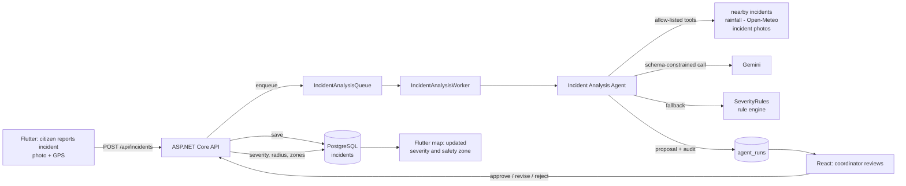

# Component A — Incident Analysis Agent

- **Component:** A — Incident & Disaster Map
- **Owner:** Student A
- **Code:** `backend/RescueSriLanka.Api/Features/ComponentA/Agents/IncidentAnalysisAgent/`
- **Related ADR:** [0001 — LLM provider](adr/0001-llm-provider.md)

## 1. Purpose

When a citizen reports a disaster from the Flutter app, someone has to decide
how serious it is and how large an area around it is unsafe. The Incident
Analysis Agent makes that first assessment. It reads the report, gathers
evidence from a fixed set of tools, and proposes:

- a **severity** (Low, Moderate, High, Critical) with a 0–100 score and a confidence;
- a **safety-zone status** (Safe, Caution, Danger) and radius in metres;
- a short **rationale** a coordinator can act on.

The agent **only proposes**. Nothing it produces changes the incident in force
until an Emergency Coordinator approves, revises or rejects it in the React
dashboard. This is the high-impact action that section 9.1 of the specification
requires to pause for human approval: a severity and zone change moves the
public safety map and sends district warning emails.

## 2. Where it sits in the system



The agent is started in two ways:

| Trigger | How | Who |
|---|---|---|
| Automatic | Every new report is queued after its photo is stored (`IncidentService.QueueFollowUps`). A background worker (`IncidentAnalysisWorker`) runs the agent. | System |
| Manual | `POST /api/incidents/{id}/analyse` — the "Run analysis / Re-run analysis" button in the React agent panel. | Emergency Coordinator |

The queue is bounded to 200 items. A citizen filing a report never waits on
the model, and a failed background run never stops the worker; the incident
can still be analysed by hand.

## 3. Input and output contract

**Input — `IncidentAnalysisInput`.** Everything the agent is allowed to see
about an incident:

| Field | Type |
|---|---|
| `IncidentId` | Guid |
| `Title`, `Description` | string |
| `Type` | Flood, Landslide, Fire, Accident, Storm, Tsunami, … |
| `Latitude`, `Longitude` | double |
| `District` | string? |
| `EstimatedAffectedPeople` | int? |
| `ImageCount` | int |

The reporter's identity, email and account details are never passed to the
agent or the model.

**Output — `IncidentAnalysisResult`.** The model is constrained to this JSON
schema (`ResponseSchema` in `IncidentAnalysisAgent.cs`):

| Field | Allowed values | Enforced by |
|---|---|---|
| `severity` | Low, Moderate, High, Critical | Schema enum, then strict enum parsing |
| `severityScore` | 0–100 | Clamped |
| `confidence` | 0–1 | Clamped |
| `recommendedZoneStatus` | Safe, Caution, Danger | Schema enum, then strict enum parsing |
| `recommendedRadiusMeters` | 100–20 000 | Clamped |
| `rationale` | non-empty text | Rejected if empty, then trimmed |

## 4. Allow-listed tools

The agent can call only the three tools below
(`IncidentAnalysisTools.cs` and `ImageStorageService.cs`). It has no access
to any other data, table or endpoint.

| Tool | What it returns | Input validation and limits | When it fails |
|---|---|---|---|
| `count_nearby_active_incidents` | Number of other active incidents within 5 km | Latitude −90…90 and longitude −180…180, else rejected. Radius clamped to 0.5–50 km. The incident itself is excluded. | Throws on invalid coordinates. Coordinates come from a validated incident, so this does not happen in practice. |
| `get_rainfall_last_48h` | Total rainfall in mm over the last 48 hours, from **Open-Meteo** (free, no API key) | Coordinates checked before any request is sent. 5-second timeout. Missing hours are skipped, not counted as zero. | Returns `null`; the agent continues without rainfall, and the run records `available: false`. |
| `load_incident_images` | Up to 3 photos, 6 MB total at most | Count and size caps | Returns fewer or no photos. |

Every tool call and its result is written to `agent_runs.tool_calls_json`.

## 5. How one run works

`IncidentAnalysisAgent.AnalyseAsync(incidentId)`:

1. **Load and record.** Load the incident. An unknown ID is refused before
   anything is saved. Create an `AgentRun` row with status `Running`, the
   objective and the input JSON.
2. **Gather evidence.** Call the three tools and record their results.
3. **Reason.**
   - If no model is configured, run the rule engine.
   - Otherwise, send the fixed system instruction, the report and tool
     evidence as a data block, and the photos to Gemini with the response
     schema.
   - Parse the answer strictly and validate it (section 3).
   - If the model is unreachable, rate-limited, returns malformed JSON, returns
     a value outside the allowed sets, or gives an empty rationale, run the rule
     engine instead and record why.
4. **Persist the proposal.** Write the output, status, model name, duration and
   completion time to the run. Write the proposal to the incident's `Ai*`
   fields: `AiSeverity`, `AiSeverityScore`, `AiConfidence`, `AiRationale`,
   `AiAnalysedAt`. The incident's `Severity` and `AffectedRadiusMeters` are not
   touched.

## 6. Deterministic fallback — the rule engine

`SeverityRules.Score` is the agent's floor, not a placeholder. It guarantees
an incident is never left unscored and that the result can always be
explained.

| Factor | Weight |
|---|---|
| Hazard type | 12–40 (Tsunami 40, Landslide 32, Flood 28, Fire 26, Storm 20, Accident 14) |
| People affected | 5–30 (8 when not reported) |
| Other active incidents within 5 km | 0–20 |
| Rainfall in 48 h (Flood and Landslide only) | 0–10 |

A score of 75 or more is Critical, 55 or more is High, 32 or more is Moderate,
and anything lower is Low. Critical and High map to a Danger zone, the others
to Caution. Rule-engine results always carry confidence 0.55 and
`UsedFallback = true`, so they can never be mistaken for a model's judgement.

## 7. Human approval

| Endpoint | Role | Effect |
|---|---|---|
| `GET /api/agentruns?incidentId=&take=` | Any signed-in user | Execution summaries, newest first (at most 200) |
| `POST /api/agentruns/{id}/approve` with `{}` | Emergency Coordinator | Applies the AI severity and radius, recomputes safety zones, and queues the district warning email |
| `POST /api/agentruns/{id}/approve` with `{ "severity": "Critical" }` | Emergency Coordinator | **Revise:** applies the coordinator's severity instead and records `SeverityOverriddenBy` and `SeverityOverriddenAt` |
| `POST /api/agentruns/{id}/reject` with `{ "reason": "…" }` | Emergency Coordinator | Leaves the incident unchanged and stores the reason on the run |

Every decision records who made it (`ApprovedByUserId`) and when
(`ApprovedAt`). In React, `AgentPanel.tsx` shows the latest run, its rationale
and tool evidence, and the approve, revise and reject controls.
`AgentActivity.tsx` lists recent runs. In Flutter, `incident_sheet.dart` shows
the AI score and rationale to the citizen.

## 8. Persisted state — `agent_runs`

| Column | Purpose |
|---|---|
| `id`, `agent_name`, `objective`, `incident_id` | Which agent ran, for what, on which incident |
| `status` | Running, Succeeded, SucceededWithFallback, Failed |
| `model` | Gemini model name, or `rule-engine` |
| `input_json` | The validated input |
| `tool_calls_json` | Each tool call and its result |
| `output_json` | The validated output |
| `error_message` | Why the model was not used, or why a coordinator rejected the proposal |
| `used_fallback` | True when the rule engine produced the result |
| `approved`, `approved_by_user_id`, `approved_at` | The human decision |
| `duration_ms`, `started_at`, `completed_at` | Timing |

Indexes are on `agent_name`, `incident_id` and `started_at`. The model's hidden
reasoning, API keys and user credentials are not stored, as section 6 of the
specification requires. The table is shared with Component B's planner.

## 9. Security and safety controls

| Control | Implementation |
|---|---|
| Role-based access | Manual analysis, approve and reject require `EmergencyCoordinator` |
| Secret protection | The Gemini key is read from configuration. `appsettings.Development.json` is git-ignored. The key is sent in the `x-goog-api-key` header, never in the URL, so it does not appear in logs. Open-Meteo needs no key. |
| Prompt-injection handling | The system instruction is fixed. Citizen text only enters the prompt as a labelled data field. Output is schema-constrained and re-validated. Even a fooled model can only produce a *proposal*; the severity in force waits for a coordinator. |
| Output validation | Strict enum parsing, clamping, and rejection of an empty rationale (section 3) |
| Timeouts | Gemini: 30 s. Open-Meteo: 5 s. |
| Retry limits | Gemini: up to 3 attempts (configurable 1–5) on HTTP 429/500/502/503/504, with backoff of 600 ms then 1 200 ms |
| Safe failure | Rule-engine fallback with the reason recorded. An unknown incident is refused and nothing is saved. A background failure is logged and does not stop the worker. |
| Data minimisation | Only the incident's own fields and photos reach the model; no personal data about the reporter does |

## 10. Evaluation

### 10.1 Automated tests

The model is replaced by a scripted fake (`FakeLlm`) so every case is
repeatable. These are rule-based assertions, not LLM-as-a-judge.

**`IncidentAnalysisAgentTests.cs`** — 20 tests

| Spec item (section 12) | Test(s) |
|---|---|
| Golden case, structured output | `GoldenCase_ValidModelAnswer_IsPersistedAsSucceededRun` |
| Business rule: the agent only proposes | `GoldenCase_AgentProposesOnly_SeverityInForceIsUnchanged` |
| Tool selection and observability | `AllowListedToolCalls_AreRecordedOnTheRun`, `ToolEvidence_IsPassedToTheModel` |
| Deterministic validation | `OutOfRangeModelValues_AreClamped`, `EmptyRationale_IsRejected_AndRuleEngineTakesOver` |
| Prompt-injection resistance | `PromptInjection_StaysInsideTheReportData_NotTheInstructions`, `PromptInjection_ThatBreaksTheSchema_IsRejected`, `PromptInjection_ThatFoolsTheModel_StillCannotChangeSeverityInForce` |
| Failure recovery | `MalformedJson_FallsBackToRuleEngine_AndRecordsWhy`, `ModelUnavailable_FallsBackToRuleEngine_AndRecordsWhy` |
| Safe failure | `NoModelConfigured_UsesRuleEngine_WithoutCallingTheModel`, `UnknownIncident_IsRefused_AndNothingIsPersisted` |
| Tool validation and failure | `RainfallTool_SumsTheLast48Hours_SkippingMissingHours`, `RainfallTool_ReturnsNull_WhenTheServiceFailsOrAnswersBadly` (4 cases), `RainfallTool_RejectsInvalidCoordinates_WithoutCallingTheService` (2 cases) |

**`AgentRunServiceTests.cs`** — 6 tests on approval enforcement

| Test | Checks |
|---|---|
| `Approve_AppliesTheProposal_WithoutMarkingAnOverride` | AI severity and radius applied, decision recorded, district warning queued |
| `Approve_CreatesTheSafetyZone` | A Critical approval produces a Danger zone |
| `Revise_AppliesTheCoordinatorsSeverity_AndRecordsTheOverride` | Coordinator's value wins, and the override is recorded |
| `Reject_LeavesTheIncidentUntouched_AndRecordsTheReason` | No change to the incident, no zone, no email |
| `Approve_ClampsAnOutOfRangeRadius` | A stored radius of 500 000 is applied as 20 000 |
| `UnknownRun_ReturnsNull_ForApproveAndReject` | Missing runs give 404 at the API |

**`SeverityRulesTests.cs`** covers the rule engine.

**Result:** `dotnet test RescueSriLanka.slnx` — **199 passed, 0 failed** (whole
backend suite, run 24 September 2026). These tests run in GitHub Actions on
every push.

### 10.2 Live model evaluation

> **TO FILL IN** from real runs against Gemini. Do not copy numbers from
> anywhere else — run the agent and read them from `agent_runs`.

Suggested query:

```sql
SELECT i.title, i.type, r.status, r.model, i.ai_severity, i.ai_severity_score,
       r.used_fallback, r.duration_ms
FROM agent_runs r JOIN incidents i ON i.id = r.incident_id
WHERE r.agent_name = 'IncidentAnalysisAgent'
ORDER BY r.started_at DESC;
```

| # | Incident (short) | Expected severity (human) | AI severity | Match? | Fallback? | Duration (ms) |
|---|---|---|---|---|---|---|
| 1 | | | | | | |
| 2 | | | | | | |
| 3 | | | | | | |

Summary to report: how many runs matched the human judgement, the
median and maximum `duration_ms` (the agent latency that section 12 asks for),
and how many runs fell back.

## 11. Known limitations

- The `note` field on an approve request is accepted but not stored.
- Re-running analysis creates a new run each time. The React panel acts on the
  latest run only.
- Nearby-incident counting loads the candidates in a bounding box and filters
  by distance in memory. That is fine at this data size, but it would need a
  spatial index (PostGIS) at national scale.
- Open-Meteo's free tier has daily request limits. A limit error is handled
  like any other failure: rainfall is simply unavailable.
