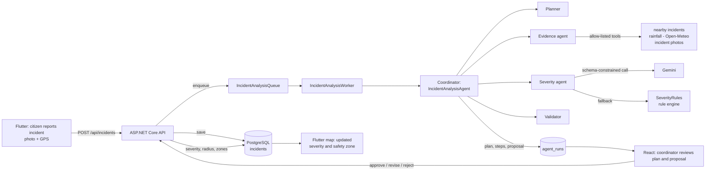
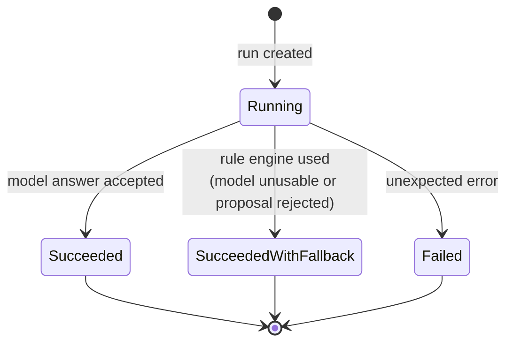

# Component A — Incident Analysis Agent

- **Component:** A — Incident & Disaster Map
- **Owner:** Student A
- **Code:** `backend/RescueSriLanka.Api/Features/ComponentA/Agents/IncidentAnalysisAgent/`
- **Related ADR:** [0001 — LLM provider](adr/0001-llm-provider.md)
- **Last updated:** 30 September 2026

## 1. Purpose

When a citizen reports a disaster from the Flutter app, someone has to decide how serious it is and how
large an area around it is unsafe. The Incident Analysis workflow makes that first assessment. It reads the
report, gathers evidence from a fixed set of tools, and proposes:

- a **severity** (Low, Moderate, High, Critical) with a 0–100 score and a confidence;
- a **safety-zone status** (Safe, Caution, Danger) and radius in metres;
- a short **rationale** a coordinator can act on.

The workflow **only proposes**. Nothing it produces changes the incident in force until an Emergency
Coordinator approves, revises or rejects it in the React dashboard. That is the high-impact action the
specification (section 9.1) requires to pause for human approval: a severity and zone change moves the
public safety map and sends district warning emails.

## 2. Where it sits in the system


```mermaid
flowchart LR
    F[Flutter: citizen reports incident<br/>photo + GPS] -->|POST /api/incidents| API[ASP.NET Core API]
    API -->|save| DB[(PostgreSQL<br/>incidents)]
    API -->|enqueue| Q[IncidentAnalysisQueue]
    Q --> W[IncidentAnalysisWorker]
    W --> CO[Coordinator:<br/>IncidentAnalysisAgent]
    CO --> P[Planner]
    CO --> E[Evidence agent]
    CO --> S[Severity agent]
    CO --> V[Validator]
    E -->|allow-listed tools| T[nearby incidents<br/>rainfall - Open-Meteo<br/>incident photos]
    S -->|schema-constrained call| LLM[Gemini]
    S -->|fallback| R[SeverityRules<br/>rule engine]
    CO -->|plan, steps, proposal| RUN[(agent_runs)]
    RUN --> RE[React: coordinator reviews plan and proposal]
    RE -->|approve / revise / reject| API
    API -->|severity, radius, zones| DB
    DB --> FM[Flutter map: updated<br/>severity and safety zone]
```

The workflow is started in two ways:

| Trigger | How | Who |
|---|---|---|
| Automatic | Every new report is queued after its photo is stored (`IncidentService.QueueFollowUps`). A background worker (`IncidentAnalysisWorker`) runs it. | System |
| Manual | `POST /api/incidents/{id}/analyse` — the "Run analysis / Re-run analysis" button in the React agent panel. Rate limited (`ai` policy, 10 calls per minute per user). | Emergency Coordinator |

The queue is bounded to 200 items. A citizen filing a report never waits on the model, and a failed
background run never stops the worker; the incident can still be analysed by hand.

## 3. The four agents

`IncidentAnalysisAgent` is the **coordinator**. It receives the objective ("classify severity and zone status
for incident X"), has the Planner build a plan, delegates each step to the agent the plan names, and
persists the plan, every step's outcome and the final result. The agents share nothing except the typed
values the coordinator passes between them (`IncidentAnalysisRoles.cs`).

| # | Agent | Responsibility | Input → output | May touch |
|---|---|---|---|---|
| — | **Planner** (`AnalysisPlannerAgent`) | Turns the incident into an ordered plan and names the agent for each step | `IncidentAnalysisInput` → `AnalysisPlan` (steps + notes) | Nothing. Deterministic, so report text cannot steer the plan. |
| 1 | **Evidence** (`EvidenceGatheringAgent`) | Runs the tools the plan names | plan + input → `EvidenceBundle` | The three allow-listed tools and the photo store. The only role that calls tools. |
| 2 | **Severity** (`SeverityAnalysisAgent`) | Classifies severity and zone status | input + evidence → `SeverityProposal` | The language model, or the rule engine. No tools, no database. |
| 3 | **Validator** (`ProposalValidationAgent`) | Checks the proposal against schema and range rules | proposal → `ValidationOutcome` | Nothing. Pure function; has the last word. |

Each has a defined responsibility, a typed input and output, and controlled permissions, and each appears
as a step in the persisted plan.

### 3.1 The plan adapts to the incident

The Planner does not emit a fixed list. It decides which tools are worth running and writes down each
omission in the plan's `notes`:

| Condition | Effect on the plan |
|---|---|
| Hazard type is Flood, Landslide, Storm or Tsunami | Rainfall lookup is planned |
| Any other hazard type | Rainfall skipped — *"Rainfall lookup skipped: not relevant to a Fire report."* |
| Report has one or more photos | Photo loading is planned |
| Report has no photos | Photo loading skipped — *"Photo loading skipped: the report has no photos."* |
| Coordinates outside −90…90 / −180…180 | The plan is refused and the run fails safely |

A skipped tool is never called and is recorded in `tool_calls` as `{ "skipped": true }`. The prompt tells the
model when rainfall was not applicable, rather than implying it was unavailable.

### 3.2 Example persisted plan (`agent_runs."PlanJson"`)

```json
{
  "steps": [
    { "step": 1, "agent": "EvidenceGatheringAgent", "action": "Gather evidence",
      "tools": ["count_nearby_active_incidents", "get_rainfall_last_48h"],
      "status": "Completed", "durationMs": 214, "detail": "1 nearby, rainfall 38 mm, 0 photo(s)" },
    { "step": 2, "agent": "SeverityAnalysisAgent", "action": "Classify severity and safety-zone status",
      "tools": [], "status": "Completed", "durationMs": 1730, "detail": "<model>: High, 2 attempts" },
    { "step": 3, "agent": "ProposalValidationAgent", "action": "Validate the proposal against schema and range rules",
      "tools": [], "status": "Completed", "durationMs": 1, "detail": "accepted" }
  ],
  "notes": ["Photo loading skipped: the report has no photos."]
}
```

*(Illustrative shape. For the report, copy a real `PlanJson` from your own run — see section 10.2.)*

## 4. Input and output contract

**Input — `IncidentAnalysisInput`.** Everything the agents are allowed to see about an incident:

| Field | Type |
|---|---|
| `IncidentId` | Guid |
| `Title`, `Description` | string (already capped at 200 and 4 000 characters by request validation) |
| `Type` | Flood, Landslide, Fire, Accident, Storm, Tsunami, Other |
| `Latitude`, `Longitude` | double |
| `District` | string? |
| `EstimatedAffectedPeople` | int? |
| `ImageCount` | int |

The reporter's identity, email and account details are never passed to the agents or the model.

**Output — `IncidentAnalysisResult`.** The model is constrained to this JSON schema (`ResponseSchema` in
`SeverityAnalysisAgent`):

| Field | Allowed values | Enforced by |
|---|---|---|
| `severity` | Low, Moderate, High, Critical | Schema enum, then strict enum parsing |
| `severityScore` | 0–100 | Clamped by the Validator, adjustment recorded |
| `confidence` | 0–1 | Clamped by the Validator, adjustment recorded |
| `recommendedZoneStatus` | Safe, Caution, Danger | Schema enum, then strict enum parsing |
| `recommendedRadiusMeters` | 100–20 000 | Clamped by the Validator, adjustment recorded |
| `rationale` | non-empty text | Proposal rejected if empty, then trimmed |

## 5. Allow-listed tools

Only the Evidence agent calls tools, and only these three (`IncidentAnalysisTools.cs`,
`ImageStorageService.cs`). It has no access to any other data, table or endpoint.

| Tool | What it returns | Input validation and limits | When it fails |
|---|---|---|---|
| `count_nearby_active_incidents` | Number of other active incidents within 5 km | Latitude −90…90 and longitude −180…180, else rejected. Radius clamped to 0.5–50 km. The incident itself is excluded. | Throws on invalid coordinates (the Planner refuses these first). |
| `get_rainfall_last_48h` | Total rainfall in mm over the last 48 hours, from **Open-Meteo** (free, no API key) | Coordinates checked before any request is sent. 5-second timeout. Missing hours are skipped, not counted as zero. | Returns `null`; the run records `available: false` and continues without rainfall. |
| `load_incident_images` | Up to 3 photos, 6 MB total at most | Count and size caps | Returns fewer or no photos. A storage error is unexpected and fails the run safely (section 6.2). |

## 6. How one run works

### 6.1 Steps

`IncidentAnalysisAgent.AnalyseAsync(incidentId)`:

1. **Load and record.** Load the incident. An unknown ID is refused before anything is saved. Create an
   `AgentRun` row with status `Running`, the objective and the input JSON.
2. **Plan.** The Planner builds the plan. It is saved on the run immediately (`PlanJson`), with every step
   `Pending`.
3. **Step 1 — Evidence.** Run the planned tools; record every call in `ToolCallsJson`. Step saved.
4. **Step 2 — Severity.**
   - No model configured → the rule engine runs.
   - Otherwise send the fixed system instruction, the report and tool evidence as a data block, and any
     photos to Gemini with the response schema.
   - Model unreachable, rate limited, malformed JSON, or a value outside the allowed sets → the rule engine
     runs instead and the reason is recorded. The number of model calls, retries included, is stored in
     `ModelAttempts`.
   Step saved.
5. **Step 3 — Validation.** Clamp out-of-range numbers (each adjustment is written into the step detail,
   e.g. `severityScore 400 clamped to 100`). An empty rationale rejects the whole proposal; the rule engine
   then supplies the result and the rejection reason is recorded. Step saved.
6. **Persist the proposal.** Write output, status, model, attempts, duration and completion time to the run.
   Write the proposal to the incident's `Ai*` fields (`AiSeverity`, `AiSeverityScore`, `AiConfidence`,
   `AiRationale`, `AiAnalysedAt`). The incident's `Severity` and `AffectedRadiusMeters` are **not** touched.


```mermaid
stateDiagram-v2
    [*] --> Running: run created
    Running --> Succeeded: model answer accepted
    Running --> SucceededWithFallback: rule engine used<br/>(model unusable or proposal rejected)
    Running --> Failed: unexpected error
    Succeeded --> [*]
    SucceededWithFallback --> [*]
    Failed --> [*]
```

### 6.2 Safe failure

A model failure is *recovered* by the rule engine and recorded. Any other exception (for example the photo
store failing) is a *safe failure*: the run is marked `Failed`, the error message is stored, the incident is
left exactly as it was, the failed step is marked `Failed` in the plan and later steps stay `Pending`, and
the exception is rethrown. A run is never left `Running`. For a manual analysis the API answers **502** with
a clear message; the details are on the run.

## 7. Deterministic fallback — the rule engine

`SeverityRules.Score` is the Severity agent's floor, not a placeholder. It guarantees an incident is never
left unscored and that the result can always be explained.

| Factor | Weight |
|---|---|
| Hazard type | 12–40 (Tsunami 40, Landslide 32, Flood 28, Fire 26, Storm 20, Accident 14) |
| People affected | 5–30 (8 when not reported) |
| Other active incidents within 5 km | 0–20 |
| Rainfall in 48 h (Flood and Landslide only) | 0–10 |

A score of 75 or more is Critical, 55 or more High, 32 or more Moderate, and anything lower Low. Critical and
High map to a Danger zone, the others to Caution. Rule-engine results always carry confidence 0.55 and
`UsedFallback = true`, so they can never be mistaken for a model's judgement.

## 8. Human approval

A proposal takes **exactly one decision**, on the **newest** analysis of its incident.

| Endpoint | Role | Effect |
|---|---|---|
| `GET /api/agentruns?incidentId=&take=` | Any signed-in user | Execution summaries, newest first (at most 200), including the plan |
| `POST /api/agentruns/{id}/approve` with `{}` | Emergency Coordinator | Applies the AI severity and radius, recomputes safety zones, queues the district warning email. Decision `Approved`. |
| `POST /api/agentruns/{id}/approve` with `{ "severity": "Critical" }` | Emergency Coordinator | **Revise:** applies the coordinator's severity instead and records `SeverityOverriddenBy/At`. Decision `Revised`. |
| `POST /api/agentruns/{id}/reject` with `{ "reason": "…" }` | Emergency Coordinator | Leaves the incident unchanged. Decision `Rejected`. |

Both approve and reject accept a note (`note` / `reason`), stored in `DecisionNote`. Every decision records who
made it (`ApprovedByUserId`) and when (`ApprovedAt`). In React, `ReportDecision.tsx` shows the latest run's
rationale and evidence with the approve, revise and reject controls; `AgentActivity.tsx` lists recent runs
with an expandable **Plan** column. In Flutter, `incident_sheet.dart` shows the AI score and rationale to the
citizen.

### 8.1 What the API refuses (HTTP 409 Conflict)

| Situation | Message |
|---|---|
| Run is `Failed` or still `Running` | No proposal to decide on |
| Already approved / revised | This proposal has already been approved |
| Already rejected | This proposal has already been rejected |
| A newer non-failed analysis exists for the incident | A newer analysis exists; review that proposal instead |
| Two coordinators decide at the same moment | Decided by someone else a moment ago |

A newer *failed* run does not block deciding the last good proposal.

### 8.2 Atomicity

- `ApprovedAt` is an EF Core **concurrency token**: the decision is written as an update that only matches a
  run that is still undecided, so exactly one of two simultaneous requests wins.
- On PostgreSQL, approve runs in **one transaction**: decision, incident change and safety-zone recompute
  commit together. If the recompute fails, nothing is kept.
- The district warning is queued only **after** the transaction commits, so a rolled-back approval never
  sends an email.

## 9. Persisted state — `agent_runs`

Table and column names are those created by EF Core migrations (`agent_runs`, PascalCase columns).

| Column | Purpose |
|---|---|
| `Id`, `AgentName`, `Objective`, `IncidentId` | Which agent ran, for what, on which incident |
| `Status` | Running, Succeeded, SucceededWithFallback, Failed — how the run itself went |
| `Model`, `ModelAttempts` | Gemini model name or `rule-engine`; model calls made (0 = never called) |
| `InputJson` | The validated input |
| `PlanJson` | The plan: steps, agent per step, status, duration, detail, and the planner's notes |
| `ToolCallsJson` | Each tool call and its result (or `skipped`) |
| `OutputJson` | The validated output |
| `ErrorMessage` | Why the model was not used, or why the run failed. **Not** used for a coordinator's rejection. |
| `UsedFallback` | True when the rule engine produced the result |
| `Decision` | Pending, Approved, Revised, Rejected — the coordinator's verdict |
| `DecisionNote`, `Approved`, `ApprovedByUserId`, `ApprovedAt` | The human decision. `ApprovedAt` is the concurrency token. |
| `DurationMs`, `StartedAt`, `CompletedAt` | Timing |

Indexes are on `AgentName`, `IncidentId` and `StartedAt`. Hidden model reasoning, API keys and user
credentials are not stored (specification section 6). The table is shared with Component B's planner. Migration
`AddAgentRunPlanAndDecision` adds `Decision`, `DecisionNote`, `ModelAttempts` and `PlanJson`, and backfills
`Decision` for runs decided before it existed.

## 10. Security and safety controls

| Control | Implementation |
|---|---|
| Role-based access | Manual analysis, approve and reject require `EmergencyCoordinator` |
| Cost / abuse control | `POST /api/incidents/{id}/analyse` is rate limited (`ai` policy) |
| Secret protection | The Gemini key is read from configuration. `appsettings.Development.json` is git-ignored. The key is sent in the `x-goog-api-key` header, never in the URL, so it does not appear in logs. Open-Meteo needs no key. |
| Prompt-injection handling | The system instruction is fixed. Citizen text only enters the prompt as a labelled data field. The plan is deterministic, so text cannot change which tools run. Output is schema-constrained and re-validated. Even a fooled model can only produce a *proposal*; the severity in force waits for a coordinator. |
| Output validation | Strict enum parsing, clamping with recorded adjustments, rejection of an empty rationale |
| Timeouts | Gemini: 30 s. Open-Meteo: 5 s. |
| Retry limits | Gemini: up to 3 attempts (configurable 1–5) on HTTP 429/500/502/503/504, backoff 600 ms then 1 200 ms; attempts recorded |
| Safe failure | Rule-engine fallback with the reason recorded; unexpected errors mark the run `Failed` and change nothing; an unknown incident is refused and nothing is saved |
| Approval integrity | One decision per proposal, newest run only, concurrency token, transactional approval, warning email after commit (section 8) |
| Data minimisation | Only the incident's own fields and photos reach the model; no personal data about the reporter does |

## 11. Evaluation

### 11.1 Automated tests

The model is replaced by a scripted fake (`FakeLlm`) so every case is repeatable. These are rule-based
assertions, not LLM-as-a-judge.

**`IncidentAnalysisAgentTests.cs`** — 27 test cases

| Spec item (section 12) | Test(s) |
|---|---|
| Golden case, structured output | `GoldenCase_ValidModelAnswer_IsPersistedAsSucceededRun` |
| Business rule: the agent only proposes | `GoldenCase_AgentProposesOnly_SeverityInForceIsUnchanged` |
| Planning and delegation | `Run_PersistsAStructuredPlan_DelegatedToThreeDistinctAgents`, `Planner_AdaptsToTheIncident_AndSaysWhatItLeftOut`, `Planner_RefusesAnIncidentWithInvalidCoordinates` |
| Tool selection and observability | `AllowListedToolCalls_AreRecordedOnTheRun`, `ToolEvidence_IsPassedToTheModel`, `ToolsThePlanLeavesOut_AreNeverCalled_AndAreRecordedAsSkipped`, `ModelRetries_AreRecordedOnTheRunAndItsStep` |
| Deterministic validation | `OutOfRangeModelValues_AreClamped`, `EmptyRationale_IsRejected_AndRuleEngineTakesOver`, `Validator_ClampsAreRecordedOnTheValidationStep` |
| Prompt-injection resistance | `PromptInjection_StaysInsideTheReportData_NotTheInstructions`, `PromptInjection_ThatBreaksTheSchema_IsRejected`, `PromptInjection_ThatFoolsTheModel_StillCannotChangeSeverityInForce` |
| Failure recovery | `MalformedJson_FallsBackToRuleEngine_AndRecordsWhy`, `ModelUnavailable_FallsBackToRuleEngine_AndRecordsWhy` |
| Safe failure | `NoModelConfigured_UsesRuleEngine_WithoutCallingTheModel`, `UnknownIncident_IsRefused_AndNothingIsPersisted`, `UnexpectedFailure_MarksTheRunFailed_RecordsWhy_AndTouchesNothing` |
| Tool validation and failure | `RainfallTool_SumsTheLast48Hours_SkippingMissingHours`, `RainfallTool_ReturnsNull_WhenTheServiceFailsOrAnswersBadly` (4 cases), `RainfallTool_RejectsInvalidCoordinates_WithoutCallingTheService` (2 cases) |

**`AgentRunServiceTests.cs`** — 19 test cases on approval enforcement

| Test | Checks |
|---|---|
| `Approve_AppliesTheProposal_WithoutMarkingAnOverride` | AI severity and radius applied, decision recorded, district warning queued |
| `Approve_CreatesTheSafetyZone_OnceTheReportIsApproved`, `Approve_OnAReportNotYetApproved_DrawsNoZone` | Zone only for an approved report |
| `Revise_AppliesTheCoordinatorsSeverity_AndRecordsTheOverride` | Coordinator's value wins, override recorded |
| `Reject_LeavesTheIncidentUntouched_AndRecordsTheReason` | No change to the incident, no zone, no email; reason in `DecisionNote`, `ErrorMessage` empty |
| `Approve_ClampsAnOutOfRangeRadius` | A stored radius of 500 000 is applied as 20 000 |
| `UnknownRun_ReturnsNull_ForApproveAndReject` | Missing runs give 404 at the API |
| `Approve_Twice_IsRefused_AndWarnsTheDistrictOnlyOnce` | Second approval refused, one email |
| `Approve_AfterReject_IsRefused_AndChangesNothing`, `Reject_AfterApprove_IsRefused_AndKeepsTheApproval` | One decision per proposal |
| `RunWithoutAProposal_CannotBeDecided` (2 cases) | Failed and Running runs |
| `Approve_StoresTheNote_AndMarksTheDecision`, `Approve_WithADifferentSeverity_IsRecordedAsRevised` | Note stored; Revised vs Approved |
| `AnOlderRun_CannotBeDecided_OnceANewerAnalysisExists`, `ANewerFailedRun_DoesNotBlockDecidingTheLastGoodProposal` | Newest-run rule |
| `TheDecisionTimestamp_IsAConcurrencyToken_SoTwoCoordinatorsCannotBothDecide` | Concurrency token configured |
| `IfTheZoneRecomputeFails_NoDistrictWarningIsQueued` | No email for a failed approval |
| `TheAnalyseEndpoint_IsRateLimited` | `ai` rate-limit policy on the endpoint |

**`SeverityRulesTests.cs`** — 11 test cases on the rule engine.

**React:** `AgentActivity.test.tsx` — 4 tests (plan rendering with delegated agents and notes, a rejection
shown as a decision with its reason, empty and error states, malformed-plan handling).

**`PostgresIntegrationTests.cs`** — 5 tests on a real PostgreSQL 16 (throwaway database per test; skipped
unless `TEST_POSTGRES` is set; CI provides a `postgres:16` service):

| Test | Checks |
|---|---|
| `EveryMigration_AppliesToAnEmptyDatabase_AndTheModelHasNoPendingChanges` | The full migration chain (both contexts, as the API runs them) builds an empty database; no model drift; the new `agent_runs` columns, types and `Decision` default |
| `TheDecisionMigration_BackfillsRunsDecidedBeforeItExisted` | Approved, rejected and undecided old rows get `Approved` / `Rejected` / `Pending` |
| `TwoCoordinatorsApprovingAtOnce_ExactlyOneWins_AndOnlyOneWarningIsQueued` | 10 rounds of two simultaneous approvals: one success, one 409-type refusal, one email |
| `ADecisionBasedOnAStaleRead_IsRejectedByTheDatabase_ThroughTheConcurrencyToken` | A write built on a stale read raises `DbUpdateConcurrencyException`; the winner's decision stands |
| `IfTheZoneRecomputeFails_TheWholeApprovalRollsBack` | Decision, severity and radius all revert; no email; the run can still be decided afterwards |

Mutation check: with the concurrency token and the transaction removed, 3 of these 5 fail.

**Result (30 September 2026):** `dotnet test RescueSriLanka.slnx` — **380 passed, 0 failed** with
`TEST_POSTGRES` set (375 passed, 5 skipped without it) (whole backend suite); `npm test` — **27 passed** (whole React suite). Both run in GitHub Actions on every push.

### 11.2 Live model evaluation

> **TO FILL IN** from real runs against Gemini. Do not copy numbers from anywhere else — run the agent and
> read them from `agent_runs`.

Suggested query (PostgreSQL; identifiers are case-sensitive, hence the quotes):

```sql
SELECT i."Title", i."Type", r."Status", r."Model", r."ModelAttempts",
       i."AiSeverity", i."AiSeverityScore", r."UsedFallback", r."DurationMs", r."PlanJson"
FROM agent_runs r JOIN incidents i ON i."Id" = r."IncidentId"
WHERE r."AgentName" = 'IncidentAnalysisAgent'
ORDER BY r."StartedAt" DESC;
```

| # | Incident (short) | Expected severity (human) | AI severity | Match? | Fallback? | Duration (ms) |
|---|---|---|---|---|---|---|
| 1 | | | | | | |
| 2 | | | | | | |
| 3 | | | | | | |

Summary to report: how many runs matched the human judgement, the median and maximum `DurationMs` (the agent
latency section 12 asks for), how many runs fell back, and one real `PlanJson`.

## 12. Known limitations

- The four agents are one deterministic pipeline with a single model-backed step (Severity). The Planner,
  Evidence and Validator are code, by design: they must be predictable and cannot be steered by report text.
  The plan varies by tools, not by adding or removing agents.
- The transaction and the concurrency conflict only exist on PostgreSQL, so they are covered by
  `PostgresIntegrationTests` (section 11.1), which runs only when `TEST_POSTGRES` is set. The in-memory tests
  verify that the token is configured and that a failing recompute queues no email.
- Re-running analysis creates a new run each time; older undecided runs can then no longer be decided (by
  design, section 8.1).
- Nearby-incident counting loads the candidates in a bounding box and filters by distance in memory. Fine at
  this data size; it would need a spatial index (PostGIS) at national scale.
- Open-Meteo's free tier has daily request limits. A limit error is handled like any other failure: rainfall
  is simply unavailable.
- The Flutter app does not display the plan; agent monitoring is a staff feature and lives in React.
