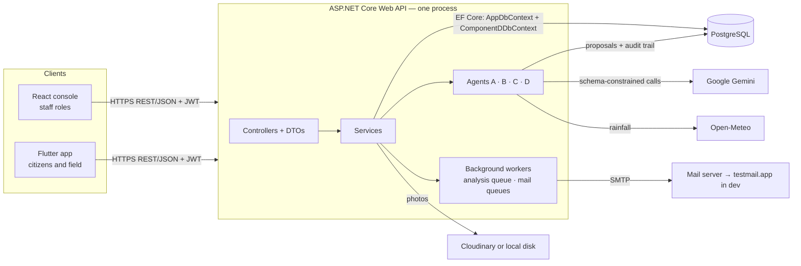

# Rescue Sri Lanka — Group Report working notes

Compiled 1 October 2026 from the code on `main` at commit `008dbf4`. This is source material laid out under
the Group Report's fourteen headings, not the report itself. The same three markers are used as in
[component-a-individual-report-notes.md](component-a-individual-report-notes.md):

- **[verified]** — read from the code, or produced by a command, on 1 Oct 2026. Safe to cite.
- **[owner]** — only the named student or the group can supply it (screenshots, live URLs, real run output,
  signatures, your own words).
- **[check]** — something in the repo that does not match what the report would naturally claim. Fix it or
  word around it before writing that part.

Older material: [group-report-outline.md](group-report-outline.md). Where these notes differ from that file,
these notes are newer — section 0 lists what changed.

Students and components, from Git author information — **[owner]** confirm every name and ID:

| Component | Owner | Role it serves | Commits on `main` |
|---|---|---|--:|
| A — Incident & Disaster Map | Lelum Jayasooriya, IT24101153 | EmergencyCoordinator | 65 |
| B — Help Requests & Travel Advisories | IT24102382 (name **[owner]**) | HelpRequestManager | 14 |
| C — Supplies, Donations & Allocation | IT24103081 (name **[owner]**) | ResourceManager | 18 |
| D — Rescue Coordination & Dispatch | Chamath Dissanayake, IT24102141 | RescueTeam ("Rescue Coordinator") | 28 |

127 commits in total, 9 Sep – 1 Oct 2026; 2 more are by `copilot-swe-agent[bot]`.

---

## 0. Read this first

### 0.1 Problems that will cost marks if left alone

| # | Issue | Why it matters | What to do |
|---|---|---|---|
| 1 | **Nothing is verifiably deployed.** `rescuesl-api.azurewebsites.net` does not resolve (DNS lookup failed when checked on 1 Oct). No Vercel URL, database host or APK is recorded anywhere in the repo. | Item 10 is a deployment report; a working health and Swagger URL is a required submission item (see the comment in `Program.cs`). | Redeploy, then fill the table in section 10 with live links and open each in a private window. |
| 2 | **No live model run is recorded for any agent.** Every agent test uses a scripted fake. A's live table is empty; D's twelve end-to-end scenarios are all `NOT RUN`. | Item 8 is an agent *evaluation* report. | Each owner captures at least one real Gemini run (section 8.6). |
| 3 | **No verified cross-component API call exists.** Components read each other's rows through the shared database; none calls another's endpoint. Component B's planner step 2 uses a hard-coded list of three hospitals, labelled `PLACEHOLDER` in its own output. | The architecture section will be asked how the agents work together. | Describe four independent workflows honestly (section 3.4). |
| 4 | **Component B's Flutter client uploads photos straight to Cloudinary** (`cloudinary_service.dart`, unsigned preset, cloud name hard-coded). | Breaks the rule the report states everywhere: clients talk only to the API. | Route it through the API as Component A does, or disclose it as a known exception. |
| 5 | **Component B sends the Gemini key in the URL** (`?key=` in `GeminiAnalysisService`). The other four Gemini callers use the `x-goog-api-key` header. | A key in a URL lands in logs and proxies; the security section cannot say "keys are never in URLs". | One-line change to a header. |
| 6 | **The four demo accounts are seeded on every start-up, production included**, with the password `Rescue@123` that is written in the repo. | Anyone who reads the repo can sign in to a deployed console as a coordinator. | Gate `DbSeeder` on Development, or change the passwords after first deploy and say so in the report. |
| 7 | **Component C's agents keep no run history.** A, B and D persist every run; C returns its recommendation and stores nothing. | The agent rubric asks for persisted state and observability. | Persist to `agent_runs`, or state the gap. |
| 8 | **Two ADRs short of covering the topics the outline lists.** All four existing ADRs are Student A's. | Item 11 asks for 3–6; the count is met, the spread is not. | Section 11 drafts three more from decisions already in the code. |
| 9 | **Test evidence is uneven.** React: 3 test files in the whole app (A, B, D; none for C). Flutter: no widget tests for A's screens. Only A has tests on real PostgreSQL. | Item 7. | State the gaps plainly (section 7.3). |

### 0.2 Where the older outline is now wrong

| Outline says | Code says [verified] |
|---|---|
| Component A has 19 endpoints, B 16, C 21 | A 20, B 22, C 29, D 28, shared 9 — 108 in total |
| "No agent code currently exists under `Features/ComponentC`" | `ResourceAllocationAgent` and `ResourceForecastAgent` exist, with 6 tests |
| ER diagram has a `SHELTER` entity | Shelters were removed by migration `RemoveComponentCShelters` (28 Sep). `ManagedSupply` replaced the idea |
| `HelpRequest.RelatedIncidentId` is a "soft ref, no FK" | It is a real foreign key to `incidents`, `ON DELETE SET NULL` |
| 236 backend tests; "Component A has zero React tests" | 380 backend tests; A has 4 React tests |
| Component A's agent is "single-step" | Plan-and-delegate since 30 Sep (planner, evidence, severity, validator) |
| ≥4 agents "A:1, B:1, D:3" | A 1, B 1, C 2, D 3 (plus D's orchestrator and deterministic guard) |
| Seed coordinator is `coordinator@rescue.lk` (also in [frontend-ui-guide.md](frontend-ui-guide.md)) | `emergency@rescue.lk` in `DbSeeder` |

---

## 1. Project overview and scope

### 1.1 Problem

Sri Lanka faces recurring, geographically distinct hazards: monsoon flooding in the west and south,
landslides in the central highlands, coastal storms, and — as 2004 showed — tsunami. Response depends on
three things happening quickly: someone hears about an incident, someone judges how serious it is, and
someone acts. Run by phone and spreadsheet, that loop has no audit trail and does not scale past a few
simultaneous incidents.

### 1.2 What was built [verified]

One platform with three deployable parts and one database:

| Part | Technology | Who uses it |
|---|---|---|
| Web API | ASP.NET Core on .NET 10, EF Core 10, Npgsql, JWT bearer auth, Swagger | Both clients |
| Database | PostgreSQL 16 (Supabase is referred to in code comments and `supabase_resource_tables.sql`) | The API only |
| Web console | React 19, TypeScript 6, Vite 8, react-router 7, react-leaflet 5 | Staff roles |
| Mobile app | Flutter (Dart SDK ^3.13), `flutter_map`, `geolocator`, `image_picker`, `flutter_secure_storage` | Citizens; Rescue Coordinator |
| Agentic AI | Seven agents inside the API process, Google Gemini with deterministic fallbacks | Called by the API only |

### 1.3 Scope by component [verified]

| Component | Business entities | Core operations beyond CRUD |
|---|---|---|
| A | Incident, IncidentImage, SafetyZone, AgentRun | Report with photo and GPS; geo "nearby" query; derived safety zones; AI severity proposal with human approval; district warning emails |
| B | HelpRequest, RequestStatusHistory, TravelAdvisory, AgentWorkflow/AgentStep | Urgency scoring; status state machine with history; verify / reject-as-fake; point-against-advisory safety check; planner workflow with approval |
| C | MedicalSupply, FoodWaterStock, ManagedSupply, Donation, DonatedSupply, ResourceAllocation, resource HelpRequest | Low-stock alerts; allocation with stock deduction and release; donation → stock conversion; batch submissions; AI allocation plan; 30-day stock forecast |
| D | RescueTeam, TeamMember, Vehicle, Assignment, Dispatch | Ranked team matching; versioned assignment plans; AI safety validation; human decision that creates a dispatch in a serializable transaction; dispatch lifecycle |
| Shared | User, PasswordResetCode | Register, login, OTP password reset, profile photo, district and email preferences |

### 1.4 Out of scope — say so rather than leave it to be found

- No push notifications; alerts are email only.
- No routing or ETA service. OSRM is named in the proposal and in code comments but is not called anywhere;
  B's ETA is distance ÷ 40 km/h against a placeholder list.
- No shelters (removed 28 Sep).
- No manual safety-zone tools: the model has `ManualOverride` and `ExpiresAt`, but no endpoint creates or
  expires a zone.
- No offline queueing of reports on mobile; "My reports" is cached for reading only.
- Web console is light mode only, and has no forgot-password flow (mobile has one).

### 1.5 Domain-complexity checklist

| Requirement | Evidence [verified] |
|---|---|
| ≥ 3 roles with distinct permissions | 5 roles, enforced with `[Authorize(Roles = …)]` |
| ≥ 4 business components, one per student | A, B, C, D under `Features/Component*` |
| CRUD, status workflows, search/filter/sort/paging, reporting | A: server-side filter, sort and paging on `GET /api/incidents`, statistics endpoint. B: `HelpRequestsReview` search/filter/sort/paginate. C: status workflows on requests and donations. D: dispatch lifecycle |
| React and Flutter serve different purposes | React = staff console; Flutter = citizen reporting and field use |
| ≥ 1 third-party integration | Gemini, Open-Meteo, Cloudinary, SMTP + testmail.app, Mapbox / CARTO / OpenStreetMap tiles, Nominatim place search |
| ≥ 1 cross-platform workflow through every layer | Section 3.5 |

---

## 2. Requirements and user roles

### 2.1 Roles [verified]

Defined in [UserRole.cs](../backend/RescueSriLanka.Api/Models/UserRole.cs), stored as text, carried in the JWT
role claim.

| Role | Gets an account by | React console | Flutter app | May do (server-enforced) |
|---|---|---|---|---|
| **Citizen** | Self-registration (`POST /api/auth/register` always creates a Citizen) | Refused at login; a stored Citizen session is cleared | Map (no account needed); Report, Help, Resources, Rescue overview, Profile once signed in | File and view own incident reports; submit, edit and cancel own help requests; submit resource requests and donations; set district and email preference |
| **EmergencyCoordinator** | Seeded (`emergency@rescue.lk`) | Disaster dashboard (`/`) | Same tabs as any signed-in user | Verify / reject / resolve incidents; override severity; delete; run analysis; approve, revise or reject AI proposals; recompute zones; test notifications. Also accepted by B's coordinator endpoints and C's manager endpoints |
| **HelpRequestManager** | Seeded (`helprequests@rescue.lk`) | Help request dashboard, Request review (`/dashboard…`) | — | List all help requests; change status; verify or reject as fake; manage travel advisories; trigger and decide planner workflows |
| **ResourceManager** | Seeded (`resources@rescue.lk`) | Resource dashboard (`/resources`) | — | Stock CRUD; allocations and release; accept or reject requests and donations; AI allocation plan and stock forecast |
| **RescueTeam** (shown as "Rescue Coordinator") | Seeded (`rescue@rescue.lk`) | Rescue coordination (`/rescue`) | Rescue tab: teams, assignments, AI safety review, dispatches | Team, member and vehicle CRUD; create, revise and validate assignments; approve / revise / reject; move a dispatch through its lifecycle |

Anonymous visitors can read incidents (approved only), safety zones, statistics, districts, and C's inventory
lists.

**[check]**
- `RescueTeam` in code, "Rescue Coordinator" on screen. The enum comment still says "receives assignments and
  reports status from the field". Use one name in the report and explain the other once.
- `EmergencyCoordinator` is also allowed on B's and C's staff endpoints (`Coordinators` / `Managers`
  constants), but **not** on D's — D's tests assert 403 for it. Draw the permission matrix from the code, not
  from the one-role-per-component picture.
- C's `POST /api/resources/help-requests` and `POST /api/resources/donations` carry no `[Authorize]`
  attribute, so they accept anonymous submissions. Confirm that is intended.

### 2.2 Functional requirements

No requirement IDs exist anywhere in the repo. The table below is a draft set written from what the code
does, so each test case in section 7 has something to link to. **[owner — group]** agree the IDs, then keep
them identical in all four individual reports.

| ID | Requirement | Component | Implemented by |
|---|---|---|---|
| FR-S1 | A visitor can register as a Citizen and sign in; staff sign in with issued accounts | Shared | `AuthController` |
| FR-S2 | A user can reset a forgotten password with a 6-digit emailed code (10 min, 5 attempts) | Shared | `AuthService` |
| FR-S3 | A user can choose a home district and opt out of email | Shared | `PATCH /api/auth/me/preferences` |
| FR-A1 | A citizen can report an incident with type, description, location and an optional photo | A | `POST /api/incidents`, `/with-photo` |
| FR-A2 | Anyone can see approved incidents and safety zones on a map and check whether a point is in a zone | A | `GET /api/incidents`, `/nearby`, `/api/safetyzones`, `/check` |
| FR-A3 | Every new report receives an AI severity and zone proposal | A | `IncidentAnalysisAgent` |
| FR-A4 | Only a coordinator's decision changes the severity in force; one decision per proposal | A | `AgentRunService` |
| FR-A5 | Subscribers in a district are emailed once when a High or Critical incident is confirmed | A | `NotificationService` |
| FR-A6 | A citizen can follow the review of their own reports | A | `GET /api/incidents/mine` |
| FR-B1 | A citizen can submit, edit and cancel a help request and follow its status history | B | `HelpRequestsController` |
| FR-B2 | A manager can verify a request or reject it as fake, and move it through its statuses | B | `/verify`, `/status` |
| FR-B3 | A manager can publish travel advisories; a user can check points against them | B | `TravelAdvisoriesController` |
| FR-B4 | A planner workflow proposes a response plan that a coordinator approves or rejects | B | `PlannerAgentService` |
| FR-C1 | A manager can maintain medical, food/water and categorised stock, with low-stock alerts | C | `ResourcesController` |
| FR-C2 | Users can submit resource requests and donations, singly or in batches | C | `help-requests`, `donations`, `/batch` |
| FR-C3 | A manager can allocate stock to a request and release it, with stock adjusted | C | `allocations`, `/release` |
| FR-C4 | An agent recommends allocations and forecasts stock; nothing is allocated without the manager | C | `ResourceAllocationAgent`, `ResourceForecastAgent` |
| FR-D1 | A rescue coordinator can maintain teams, members and vehicles | D | `RescueTeamsController` |
| FR-D2 | The system ranks teams for a required skill and records a versioned assignment | D | `/api/assignments/match`, `/revise` |
| FR-D3 | An agent validates an assignment's safety and recommends approve, revise or reject | D | `/api/assignments/{id}/validate` |
| FR-D4 | Only a human decision creates a dispatch, after the facts are re-checked | D | `/api/assignments/{id}/decision` |
| FR-D5 | A dispatch moves Pending → Dispatched → EnRoute → OnScene → Resolved, or is cancelled | D | `PATCH /api/dispatches/{id}/status` |

### 2.3 Non-functional requirements [verified unless marked]

| Area | What the system does |
|---|---|
| Security | JWT with issuer, audience, lifetime and signing-key validation; role checks on the server; rate limits (`auth` 10/min per IP, `ai` 10/min per user) |
| Reliability | Agents fall back to deterministic rules when the model is unavailable; background queues keep model and mail latency off the request path |
| Auditability | `agent_runs`, `AgentWorkflows`/`AgentSteps`, `RequestStatusHistories`, who/when fields on decisions |
| Performance | Measured for Component A only (section 9) |
| Accessibility | Severity is never shown by colour alone; palette checked for colour-blind separation; `aria-sort`, `aria-invalid`, `role="alert"` in the console |
| Portability | Runs with no external account: local-disk photos, logged email, rule-engine analysis, OpenStreetMap tiles |
| Maintainability | One folder per component; CI builds, lints and tests all three codebases on every push |

---

## 3. Full-stack and Agentic AI architecture

### 3.1 System architecture [verified]



Rules the code follows:

- **Clients talk only to the API.** Neither client holds a database credential or a model key. The one
  exception is flagged in section 0.1 item 4.
- **Agents are internal services**, invoked by controllers or a background worker. None is a separate
  process, so there is no second service to secure.
- **Vertical slices.** `Features/ComponentA … ComponentD` each hold their own controllers, DTOs, models,
  services and agents. Shared: `User`, auth, `ILlmClient`, `IImageStore`, `IEmailSender`, `GeoService`,
  `GlobalExceptionHandler`.

### 3.2 Backend layering [verified]

| Layer | Responsibility | Example |
|---|---|---|
| Controller | Routing, auth attributes, model validation, mapping exceptions to status codes | `AgentRunsController` turns `InvalidOperationException` into 409 |
| DTO | The only shapes that cross the API boundary; enums travel as strings | `IncidentDto.FromIncident` |
| Service | Business rules and data access, async with `CancellationToken` | `AgentRunService.ApproveAsync` |
| Agent | Planning, tool calls, model call, validation | `IncidentAnalysisAgent` |
| Infrastructure | Provider interfaces with a working no-account default | `ILlmClient`, `IImageStore`, `IEmailSender` |

Cross-cutting pipeline, in order: exception handler → Swagger → static files → CORS → authentication →
authorization → rate limiter → controllers; `/health` reports whether PostgreSQL is reachable.

### 3.3 Agentic AI architecture [verified]

| # | Agent | Component | Trigger | Model use | Tools (allow-listed) | Deterministic guard | Human gate | Persisted in |
|--:|---|---|---|---|---|---|---|---|
| 1 | Incident Analysis (planner, evidence, severity, validator roles) | A | Every new report (background queue); manual re-run | Gemini via `ILlmClient`, JSON schema, photos | `count_nearby_active_incidents`, `get_rainfall_last_48h`, `load_incident_images` | Enum parsing, clamping, empty-rationale rejection, `SeverityRules` fallback | Coordinator approves, revises or rejects | `agent_runs` |
| 2 | Planner | B | `POST /api/agentworkflows/trigger` | Optional Gemini explanation of a rule-based score | None in the tool-calling sense; three fixed steps | Duplicate-workflow and still-actionable checks | Manager approves or rejects | `AgentWorkflows`, `AgentSteps` |
| 3 | Resource Allocation | C | `…/allocation-recommendation`, `…/allocation-plan` | Gemini via `ILlmClient`, JSON schema | None; candidates are passed in the prompt | Resource must be a listed candidate; quantity ≤ stock; shared stock subtracted in priority order; `RequiresApproval` forced true | Manager creates the allocation separately | **Nothing** |
| 4 | Resource Forecast | C | `GET /api/resources/stock-forecast` | Gemini writes a two-sentence summary only | None | All figures computed in code; model may not change them | Advisory only | **Nothing** |
| 5 | Orchestrator's incident analysis | D | `POST /api/agents/workflows` | Gemini | — | — | — | `AgentSteps` |
| 6 | Dispatch Recommendation | D | Step 2 of the orchestrator | Gemini function calling | `search_teams`, `get_team_details` (read-only) | Vehicle availability re-read from the database | — | `AgentSteps` |
| 7 | Safety Validation | D | `POST /api/assignments/{id}/validate`; step 3 of the orchestrator | Gemini function calling, at most 12 iterations | Seven read-only checks bound to assignment and plan version | Ten mandatory checks run regardless of what the model asks for; stale plan cannot approve | Rescue Coordinator decides; `SafetyValidationAgent` re-validates live facts before dispatch | `AgentWorkflows`, `AgentSteps` |

**The pattern all four share:** the agent proposes, deterministic code validates, a named human decides, and
only then does operational state change.

**[check]**
- Two LLM integration styles coexist. A and C use the shared `ILlmClient` (`GoogleAiClient`: retries, 30 s
  timeout, header key). B and D each built their own HTTP client. B's has no schema constraint, no retry,
  defaults to `gemini-1.5-flash`, and puts the key in the URL.
- Model configuration is not uniform: A, B and C read `GoogleAi:Model`; D reads `Gemini:Model` first, then
  `GoogleAi:Model`. Default is `gemini-3-flash-preview` everywhere except B.
- D's `IIncidentAnalysisAgent.cs` still opens with "PLACEHOLDER — owned by Student A" and contains
  `StubIncidentAnalysisAgent`. `Program.cs` registers `GeminiIncidentAnalysisAgent`; the stub is unused.
  Component D classifies the incident itself and does not use Component A's proposal.
- B's step named `ResourceLogisticsPlanningAgent` and D's step of the same enum name are unrelated code.

### 3.4 How the components relate — the honest version

| From | To | Mechanism [verified] |
|---|---|---|
| B `HelpRequest` | A `Incident` | Foreign key `RelatedIncidentId` (`SET NULL`) |
| D `IncidentReadService` | A `Incident` | Reads rows in-process through `AppDbContext` |
| D `Assignment` | A `Incident`, B `HelpRequest` | Plain uuid columns, no foreign key |
| C `ResourceAllocation` | A `Incident`, C request | Plain uuid columns, no foreign key |
| C, and the password-reset flow | A's mail infrastructure | Shared `IEmailSender`, `ResourceEmailQueue` |

There is no HTTP call from one component to another, and no agent invokes another component's agent. The
proposal describes a planner delegating to three specialist agents; what was built is four self-contained
workflows on a shared database, shared identity and a shared approval pattern. Say that, and give the reason:
one-student-per-component ownership made independent delivery the safer route.

### 3.5 The end-to-end cross-platform workflow [verified in code]

1. **Flutter** — a citizen fills the report form, takes a photo, and the app reads GPS.
2. **API** — `POST /api/incidents/with-photo` authenticates, validates, saves the incident
   (`Status = Reported`), stores the photo, then queues analysis and a receipt email.
3. **PostgreSQL** — incident, image and audit fields are persisted.
4. **Agent** — the worker runs the Incident Analysis Agent; the plan, tool calls and proposal go to
   `agent_runs`, and the proposal to the incident's `Ai*` columns. `Severity` is untouched.
5. **React** — the Emergency Coordinator opens the report, marks it genuine, then approves, revises or
   rejects the proposal. One transaction applies the decision, severity, radius and zone recompute; the
   district warning is queued after commit.
6. **Flutter** — "My reports" shows the new status; the public map shows the incident and its zone.

Component D has a second candidate (assignment → AI validation → human decision → dispatch → status from
Flutter), but its live walkthrough is recorded as `NOT RUN` in
[component-d-e2e-test-results.md](demo/component-d-e2e-test-results.md).

**[owner — A]** numbered screenshots of steps 1–6.

---

## 4. Database design and ER diagram

### 4.1 Design decisions [verified]

- **One PostgreSQL database, two EF Core contexts.** `AppDbContext` holds shared, A, B and C tables.
  `ComponentDDbContext` holds D's five tables with its own migration history, and maps
  `AgentWorkflows`/`AgentSteps` with `ExcludeFromMigrations()` because `AppDbContext` owns them. On start-up
  the API migrates both.
- **Two naming styles.** Shared and A tables are snake_case (`users`, `incidents`, `agent_runs`); B, C and D
  use EF's default PascalCase (`HelpRequests`, `RescueTeams`). Columns are PascalCase everywhere, so SQL
  needs quoted identifiers.
- **Enums.** A, B and shared store enums as text. D stores them as integers and pins the numeric values in
  code. C uses plain strings (`"Pending"`, `"Active"`), with no enum.
- **Two things called HelpRequest.** B's citizen help request (`HelpRequests`) and C's resource request
  (`resource_help_requests`). They are unrelated; say so before a viva question does.
- **Cross-component references are mostly soft.** Only `HelpRequests.RelatedIncidentId` and
  `HelpRequests.CitizenId` are real foreign keys across a component boundary.
- **Two stores for agent state.** `agent_runs` (one row per run, JSON as text) for A; `AgentWorkflows` +
  `AgentSteps` (jsonb columns) for B and D.

### 4.2 ER diagram [verified against both DbContexts and the model classes]

Solid lines are enforced foreign keys. Soft references are listed in 4.3.

```mermaid
erDiagram
    USERS ||--o{ PASSWORD_RESET_CODES : "has (cascade)"
    USERS ||--o{ HELP_REQUESTS : "submits (restrict)"
    INCIDENTS ||--o{ INCIDENT_IMAGES : "has (cascade)"
    INCIDENTS ||--o{ SAFETY_ZONES : "derives (cascade)"
    INCIDENTS |o--o{ HELP_REQUESTS : "related to (set null)"
    HELP_REQUESTS ||--o{ REQUEST_STATUS_HISTORIES : "has (cascade)"
    AGENT_WORKFLOWS ||--o{ AGENT_STEPS : "has (cascade)"
    RESCUE_TEAMS ||--o{ TEAM_MEMBERS : has
    RESCUE_TEAMS ||--o{ VEHICLES : has
    RESCUE_TEAMS ||--o{ ASSIGNMENTS : "assigned to"
    VEHICLES |o--o{ ASSIGNMENTS : "used in (restrict)"
    ASSIGNMENTS ||--o| DISPATCHES : "becomes (unique)"

    USERS {
        uuid Id PK
        string FullName
        string Email UK
        string PasswordHash
        string Role
        string District
        bool EmailNotificationsEnabled
        string PhotoUrl
    }
    PASSWORD_RESET_CODES {
        uuid Id PK
        uuid UserId FK
        string CodeHash
        int Attempts
        datetime ExpiresAt
        datetime ConsumedAt
    }
    INCIDENTS {
        uuid Id PK
        string Title
        string Type
        string Severity
        string Status
        double Latitude
        double Longitude
        int AffectedRadiusMeters
        string District
        string AiSeverity
        int AiSeverityScore
        uuid ReportedByUserId
        uuid VerifiedByUserId
        datetime DistrictWarningSentAt
        bool IsActive
        datetime CreatedAt
        datetime UpdatedAt
    }
    INCIDENT_IMAGES {
        uuid Id PK
        uuid IncidentId FK
        string StoragePath
        string ContentType
        long SizeBytes
    }
    SAFETY_ZONES {
        uuid Id PK
        string Status
        string Source
        double CenterLatitude
        double CenterLongitude
        int RadiusMeters
        uuid SourceIncidentId FK
        bool IsActive
    }
    AGENT_RUNS {
        uuid Id PK
        string AgentName
        uuid IncidentId
        string Status
        string Model
        text PlanJson
        text ToolCallsJson
        text OutputJson
        bool UsedFallback
        string Decision
        uuid ApprovedByUserId
        datetime ApprovedAt
    }
    HELP_REQUESTS {
        uuid Id PK
        uuid CitizenId FK
        string Type
        string Description
        double Latitude
        double Longitude
        uuid RelatedIncidentId FK
        int UrgencyScore
        string Status
        string VerificationStatus
        uuid VerifiedByUserId
    }
    REQUEST_STATUS_HISTORIES {
        uuid Id PK
        uuid HelpRequestId FK
        string OldStatus
        string NewStatus
        uuid ChangedByUserId
        datetime ChangedAt
    }
    TRAVEL_ADVISORIES {
        uuid Id PK
        string AreaName
        double Latitude
        double Longitude
        double RadiusMeters
        string SafetyLevel
        datetime ExpiresAt
    }
    AGENT_WORKFLOWS {
        uuid Id PK
        int ObjectiveType
        uuid ObjectiveId
        jsonb Plan
        int Status
        uuid ApprovedByUserId
        jsonb FinalOutcome
    }
    AGENT_STEPS {
        uuid Id PK
        uuid AgentWorkflowId FK
        int StepNumber
        int TargetAgent
        jsonb ToolResult
        jsonb ValidationResult
        int Status
    }
    MEDICAL_SUPPLIES {
        uuid Id PK
        string Name
        int QuantityOnHand
        int LowStockThreshold
        bool IsActive
    }
    FOOD_WATER_STOCKS {
        uuid Id PK
        string ItemName
        decimal QuantityOnHand
        decimal LowStockThreshold
    }
    MANAGED_SUPPLIES {
        uuid Id PK
        string Category
        string Name
        decimal QuantityOnHand
        decimal LowStockThreshold
    }
    DONATIONS {
        uuid Id PK
        uuid UserId
        uuid SubmissionId
        string DonationType
        decimal Quantity
        string Status
    }
    DONATED_SUPPLIES {
        uuid Id PK
        uuid DonationId UK
        string Name
        decimal QuantityOnHand
    }
    RESOURCE_ALLOCATIONS {
        uuid Id PK
        string ResourceType
        uuid ResourceId
        decimal Quantity
        uuid HelpRequestId
        uuid IncidentId
        string Status
    }
    RESOURCE_HELP_REQUESTS {
        uuid Id PK
        uuid UserId
        string NeedType
        string Description
        string Status
    }
    RESCUE_TEAMS {
        uuid Id PK
        string Name
        int Status
        double BaseLatitude
        double BaseLongitude
    }
    TEAM_MEMBERS {
        uuid Id PK
        uuid RescueTeamId FK
        int Skill
        bool IsAvailable
    }
    VEHICLES {
        uuid Id PK
        uuid RescueTeamId FK
        string PlateNumber
        int Type
        int Status
        int Capacity
    }
    ASSIGNMENTS {
        uuid Id PK
        uuid IncidentId
        uuid HelpRequestId
        uuid RescueTeamId FK
        uuid VehicleId FK
        int RequiredSkill
        int RequiredCapacity
        int Status
        int PlanVersion
    }
    DISPATCHES {
        uuid Id PK
        uuid AssignmentId FK
        int Status
        int ApprovalStatus
        datetime DispatchedAt
        datetime OnSceneAt
        datetime ResolvedAt
    }
```



The workflow and step enums (`ObjectiveType`, `Status`, `TargetAgent`) are integer columns — confirmed in
`AppDbContextModelSnapshot` — unlike A's and B's other enums, which are text.

### 4.3 Soft references (uuid columns with no foreign key) [verified]

| Column | Points at | Consequence |
|---|---|---|
| `incidents.ReportedByUserId`, `VerifiedByUserId`, `SeverityOverriddenBy` | `users` | A deleted user leaves a dangling id |
| `agent_runs.IncidentId`, `ApprovedByUserId` | `incidents`, `users` | `IncidentService.DeleteAsync` removes an incident's runs by hand |
| `AgentWorkflows.ObjectiveId` | `HelpRequests` or `incidents` | Polymorphic by `ObjectiveType` |
| `Assignments.IncidentId`, `HelpRequestId` | A and B tables in the other context | D cannot navigate to them through EF |
| `ResourceAllocations.ResourceId` | One of three stock tables, by `ResourceType` | Polymorphic |
| `ResourceAllocations.HelpRequestId`, `IncidentId`; `Donations.UserId`; `DonatedSupplies.DonationId`; `resource_help_requests.UserId` | C and A tables, `users` | No referential check |

Present this as a named trade-off — component independence against referential integrity — not as an
oversight.

### 4.4 Constraints, indexes, concurrency [verified]

| Kind | Where |
|---|---|
| Unique | `users.Email`; `Dispatches.AssignmentId` (1:1); `DonatedSupplies.DonationId`; `AgentSteps(AgentWorkflowId, StepNumber)` |
| CHECK | B only: `UrgencyScore` 0–100; latitude and longitude ranges on `HelpRequests` and `TravelAdvisories`; `RadiusMeters` 0–100 000 |
| Concurrency token | `agent_runs.ApprovedAt` — a second coordinator's update matches no row |
| Transactions | A: approval (decision + incident + zones). D: dispatch creation and status change at `Serializable` |
| Audit fields | A: `CreatedAt`/`UpdatedAt` on `Incident`. D: stamped centrally in `SaveChanges` through `IComponentDAuditable`. C: `UpdatedAtUtc` / `CreatedAtUtc` |
| Indexes | Filter columns on `incidents`; `(Latitude, Longitude)`; `users.District`; `(Status, UrgencyScore)` on help requests; `(Status, CreatedAtUtc)` on C's requests and donations |

**[check]** A and C have no CHECK constraints (ranges are enforced by DTO validation only). C's entities
have no created/updated pair.

### 4.5 Migrations [verified] — 20 in total

| Context | Migrations |
|---|---|
| `AppDbContext` (17) | `InitialAuth`, `ComponentA_IncidentsAndZones`, `AgentRuns` (9 Sep); `EmailNotifications` (21 Sep); `AddHelpRequests` (22 Sep); `AddComponentC` (23 Sep); `ComponentBSchemaAlignment`, `ComponentBIntegrity` (25 Sep); `AddUserPhotoUrl` (26 Sep); `AddPasswordResetCodes`, `AddResourceSubmitterLinks`, `AddDonatedSupplyInventory`, `AddManagedSupplyCategories`, `AddDonationSubmissionGroups`, `ConsolidateDonatedSupplyInventory` (27 Sep); `RemoveComponentCShelters` (28 Sep); `AddAgentRunPlanAndDecision` (30 Sep) |
| `ComponentDDbContext` (3) | `AddComponentD` (18 Sep), `EnhanceComponentDAssignmentSafety` (21 Sep), `AddComponentDAuditFields` (29 Sep) |

Seeding: `DbSeeder` (four staff accounts, idempotent, realigns roles), `ComponentBDataSeeder` (Development
only), `ResourceDataSeeder`, `IncidentSeeder` (behind `SeedSampleIncidents`), `ComponentDDataSeeder`
(Development and `ComponentD:SeedDemoData`).

**[check]** `backend/supabase_resource_tables.sql` creates a `HelpRequests` table with Component C's columns
— the name Component B's migration owns. It predates the rename to `resource_help_requests`. Do not present
it as the schema; delete it or mark it obsolete.

---

## 5. API, React and Flutter design

### 5.1 API conventions [verified]

- REST over JSON; enums as strings (`JsonStringEnumConverter`); Swagger UI at `/swagger` with a Bearer
  "Authorize" button; `/health` checks PostgreSQL.
- Errors: validation → 400 with `ProblemDetails`; missing or hidden → 404; rule conflict → 409; rate limit →
  429; upstream failure → 502/503; anything unhandled → a generic 500 with no internal detail outside
  Development.
- Paging is opt-in on `GET /api/incidents` (`page`, `pageSize`, `sortBy`, `sortDir`) with the total in
  `X-Total-Count`, so existing callers that send no paging parameters were not broken.

**[check]** Error bodies are not uniform: A returns `ProblemDetails`; B, C and D mostly return
`{ "error": "…" }`. The React client reads `detail`, then `error`, then `title`, so both work.

### 5.2 Endpoint inventory [verified] — 108 endpoints

| Area | Controller | Route prefix | Endpoints | Notable operations |
|---|---|---|--:|---|
| Shared | `AuthController` | `/api/auth` | 8 | login, register, forgot-password, verify-reset-code, reset-password, me, me/preferences, me/photo |
| Shared | `DistrictsController` | `/api/districts` | 1 | The 25 districts |
| A | `IncidentsController` | `/api/incidents` | 12 | nearby, statistics, mine, with-photo, status, severity, analyse |
| A | `AgentRunsController` | `/api/agentruns` | 3 | list, approve, reject |
| A | `SafetyZonesController` | `/api/safetyzones` | 3 | list, check, recompute |
| A | `NotificationsController` | `/api/notifications` | 2 | test, inbox |
| B | `HelpRequestsController` | `/api/HelpRequests` | 12 | mine, ai-draft-analysis, ai-analysis, ai-priority, status, history, verify |
| B | `TravelAdvisoriesController` | `/api/TravelAdvisories` | 7 | all, check-safety |
| B | `AgentWorkflowsController` | `/api/agentworkflows` | 3 | trigger, get, decision |
| C | `ResourcesController` | `/api/resources` | 29 | three stock families, alerts/low-stock, allocations, match, release, allocation-recommendation, allocation-plan, stock-forecast, help-requests (+batch), donations (+batch) |
| D | `RescueTeamsController` | `/api/rescueteams` | 13 | teams, members, vehicles, availability and status |
| D | `AssignmentsController` | `/api/assignments` | 7 | match, revise, validate, decision |
| D | `DispatchesController` | `/api/dispatches` | 5 | status transition; two legacy routes answer 409 by design |
| D | `AgentWorkflowController` | `/api/agents/workflows` | 2 | start, get |
| D | `RescueOverviewController` | `/api/rescue/overview` | 1 | Safe summary for any signed-in user (no names, phones or plates) |

Full Component A table with auth and status codes:
[component-a-individual-report-notes.md §2.2.1](component-a-individual-report-notes.md). **[owner — B, C, D]**
produce the same table for your component.

**[check]** C has one 29-endpoint controller over one 1 087-line service. Be ready to explain the choice.

### 5.3 React design [verified]

- **Structure.** `App.tsx` is a session gate (login ↔ console). `ConsoleShell` maps the account's role to its
  pages; a role with no page is shown "no access" rather than another role's dashboard; unknown URLs
  redirect to the role's first page.
- **Shared code.** `shared/api/client.ts` (`apiFetch`, `apiFetchPage`, bearer token, 401 → sign out),
  `shared/auth/session.ts`, `shared/config/tiles.ts`.
- **State.** Plain `useState`/`useEffect` in every component; no store.
- **Styling.** Plain CSS with design tokens in `index.css`; no component library.

| Role | Page(s) | Main views |
|---|---|---|
| EmergencyCoordinator | `DisasterDashboard` | Overview, Disaster map, Safety zones, Incident queue (sort, page), Agent activity (plan view); detail drawer with photos and `ReportDecision` |
| HelpRequestManager | `HelpRequestDashboard`, `HelpRequestsReview`, `TravelAdvisoryManager` | Metrics, map and priority queue; search/filter/sort/paginate with AI review and status controls; advisory CRUD |
| ResourceManager | `ResourceDashboard` | Overview, Supplies, Requests, Donate |
| RescueTeam | `RescueDashboardPage` → `RescueCoordinatorDashboard`, `ResourceManagementPanel` | Overview, Rescue teams, Assignments, AI safety review, Active dispatches |

**[check]** [frontend-ui-guide.md](frontend-ui-guide.md) predates components C and D and the role guards:
it says the UI does not hide actions by role, names `ReviewPanel`/`AgentPanel` (now `ReportDecision`), and
lists resource screens as not built. Do not quote it without checking.

### 5.4 Flutter design [verified]

- **Shell.** `HomeShell` builds its tab bar from the session: Map and Profile when signed out; Report, Help,
  Resources and Rescue are added on sign-in. An `IndexedStack` keeps each tab's state. iOS gets a floating
  glass tab bar, other platforms the Material one.
- **State.** `StatefulWidget` + `setState`; one `AuthService extends ChangeNotifier` created in `main.dart`.
- **Session.** `flutter_secure_storage`, with a one-time migration from an older `SharedPreferences` copy.
- **Configuration.** `AppConfig.apiBaseUrl`: `--dart-define=API_BASE_URL`, else `10.0.2.2:5093` on the
  Android emulator, else `localhost:5093`.

| Component | Screens | Device features |
|---|---|---|
| Shared | Splash, login, register, forgot password / OTP / reset, profile and notification settings | Image picker (profile photo) |
| A | `ReportScreen`, `LocationPickerScreen`, `MyReportsView`, `DisasterMapScreen`, `IncidentSheet` | Camera, gallery, GPS |
| B | `home_screen`, `submit_request_screen`, `my_requests_screen`, `my_requests_map_screen`, `safety_check_screen` | Camera / gallery, GPS |
| C | `resource_home_screen` (request / donate, multi-item) | None |
| D | `rescue_coordinator_dashboard`, `rescue_teams_screen`, `assignments_screen`, `ai_safety_review_screen`, `active_dispatches_screen`, `rescue_overview_screen` | None |

**[check]** The Rescue tab is added for every signed-in user. A Citizen sees only the safe overview
(server-enforced); explain that the tab is shared and the content is role-dependent. C and D have no device
feature — a defensible choice for form-and-list screens, but have the answer ready.

---

## 6. Technical report (10–15 pages) — material and suggested split

| Section | Pages | Draw from |
|---|--:|---|
| 6.1 Architecture and integration rules | 1–2 | §3.1, §3.2 |
| 6.2 Backend design | 2 | §3.2, §5.1; DI lifetimes below |
| 6.3 Component deep dives (A, B, C, D) | 4–6 | Below |
| 6.4 Data model and migrations | 1–2 | §4 |
| 6.5 Agentic AI at system level | 1–2 | §3.3, §3.4 |
| 6.6 Third-party integrations | 1 | Below |
| 6.7 Limitations | 0.5–1 | §1.4, §0.1 |

**Dependency injection [verified].** Services and agents are scoped. Queues are singletons with hosted
workers (`IncidentAnalysisWorker`, `NotificationWorker`, `ResourceEmailQueue`); each worker opens its own
scope per item. HTTP clients are typed (`AddHttpClient<T>`) with explicit timeouts: Gemini 30 s, Open-Meteo
5 s, Cloudinary 20 s, testmail 15 s.

**Component A — what to explain.** The approval gate (`AgentRunService.ApproveAsync`): one decision per
proposal, newest run only, one transaction, a concurrency token, email after commit. Derived safety zones:
rebuilt only from active, approved incidents. Report visibility: an unreviewed report answers 404 to
everyone except its reporter and staff. Source:
[component-a-individual-report-notes.md](component-a-individual-report-notes.md).

**Component B — what to explain [verified].** Two independent state dimensions on a help request: workflow
`Status` (Pending → Assigned → InProgress → Resolved / Cancelled, every change written to
`RequestStatusHistories`) and `VerificationStatus` (PendingVerification → Verified / RejectedFake). Urgency is
computed, not entered. Database CHECK constraints back the DTO rules. The planner writes a three-step plan,
runs it, and stops at `AwaitingApproval`; a decision on anything else answers 409. **[owner — B]** the
urgency formula, the allowed status transitions, and one worked example.

**Component C — what to explain [verified].** Three stock families behind one service. Allocation deducts
stock and release restores it. Accepting a donation converts it into stock (`DonatedSupply`, unique per
donation). Batch endpoints group several items under one `SubmissionId`. In an AI allocation plan the model
ranks and proposes, then `BuildPlan` walks the model's own priority order and subtracts shared stock itself,
downgrading any item that over-claims — because a model cannot be trusted to do arithmetic across a list.
**[owner — C]** the transaction boundaries inside `ResourceManagementService`, and why shelters were removed.

**Component D — what to explain [verified].** An assignment carries a `PlanVersion`; revising it increments
the version, so a validation of version N cannot approve version N+1. Validation is advisory. The decision
endpoint re-checks live facts with the deterministic `SafetyValidationAgent` and creates the dispatch inside
a `Serializable` transaction, reserving the team (`OnMission`) and vehicle (`InUse`); resolving or
cancelling releases them. Dispatch transitions are a fixed table (`AllowedTransitions`). The two legacy
dispatch routes deliberately answer 409. **[owner — D]** the ranking rule in `TeamMatchingService`.

**Third-party integrations [verified].**

| Service | Used for | Called from | Credential | Without it |
|---|---|---|---|---|
| Google Gemini | Agent reasoning (all four components) | API | `GoogleAi:ApiKey` (D also reads `Gemini:*`) | Deterministic fallback |
| Open-Meteo | 48-hour rainfall | API | None | Rainfall recorded as unavailable |
| Cloudinary | Incident and profile photos | API (and B's Flutter client directly) | `Cloudinary:*` | Local disk |
| SMTP via MailKit | Receipts, district warnings, reset codes, resource mail | API workers | `Email:Smtp:*` | Messages are logged |
| testmail.app | Development inbox and read-back | API | `Email:Testmail:*` | Inbox endpoint answers 503 |
| Mapbox | React basemap | Browser | `VITE_MAPBOX_TOKEN` | OpenStreetMap tiles |
| CARTO Voyager | Flutter basemap | App | None | — |
| OpenStreetMap Nominatim | Place search on the mobile map | App | None | Search unavailable |

**[check]** Nominatim and CARTO are called straight from the Flutter app. Public map tiles and geocoding are
a normal exception to "clients talk only to the API"; name them as such. The Nominatim requests send an
identifying `User-Agent`, as its usage policy requires (`place_search_service.dart`).

---

## 7. Software testing report (6–10 pages)

### 7.1 Strategy [verified]

| Level | Tooling | How dependencies are handled |
|---|---|---|
| Unit and service | xUnit | EF Core in-memory provider (`TestDbFactory`); fakes for LLM, mail, image store |
| HTTP integration | `WebApplicationFactory` (`ComponentDApiFactory`) | Real routing, JWT middleware, controllers; in-memory database |
| Database integration | xUnit `PostgresFact` | Real PostgreSQL 16, one throwaway database per test; skipped unless `TEST_POSTGRES` is set |
| Agent evaluation | xUnit with scripted model fakes | Rule-based assertions, no LLM-as-judge |
| React | Vitest, React Testing Library, jsdom | API module mocked with `vi.mock` |
| Flutter | `flutter_test` | Mock HTTP client, in-memory secure storage |
| Performance | `tools/perf/load_test.py` | Local Release build, throwaway database |
| CI | GitHub Actions | `postgres:16` service container for the database tests |

### 7.2 Results [verified — whole-repository totals, run on 1 Oct 2026 at this commit]

| Suite | Command | Result |
|---|---|---|
| Backend | `dotnet test RescueSriLanka.slnx` | 375 passed, 0 failed, 5 skipped (the PostgreSQL tests, `TEST_POSTGRES` unset). 380 passed with it set, recorded 30 Sep |
| React | `npm test` | 27 passed, 3 files |
| Flutter | `flutter test` | 65 passed |

**[owner — each]** re-run and screenshot your own output; screenshot a green GitHub Actions run.

### 7.3 Coverage by component [verified]

| Component | Backend test files | React | Flutter | Notable gaps [check] |
|---|---|---|---|---|
| Shared | `PreferencesTests`, `SriLankaDistrictsTests`, `GlobalExceptionHandlerTests` | — | `auth_test.dart`, `app_ui_test.dart`, `widget_test.dart`, `place_search_service_test.dart` | No dedicated auth test file: `PreferencesTests` calls the auth service only twice, so login, registration and the password-reset flow are thinly covered on the API — confirm before claiming otherwise. No React login-form or protected-route test |
| A | `IncidentAnalysisAgentTests`, `AgentRunServiceTests`, `SeverityRulesTests`, `SafetyZoneServiceTests`, `NotificationServiceTests`, `IncidentReadTests`, `IncidentVisibilityTests`, `IncidentStatusRollbackTests`, `ReportWithPhotoTests`, `GeoServiceTests`, `PostgresIntegrationTests` | `AgentActivity.test.tsx` | API client group in `auth_test.dart` | No HTTP-level role test (a Citizen getting 403 on approve); no widget tests for report or map screens |
| B | `ComponentBServiceTests`, `ComponentBPlannerAgentTests`, `ComponentBAuthorizationIntegrationTests`, `ComponentBDataSeederTests` | `TravelAdvisoryManager.test.tsx` | `component_b_test.dart`, `help_tab_test.dart` | CHECK constraints are never exercised on real PostgreSQL |
| C | `ResourceManagementServiceTests`, `ResourceAllocationAgentTests` | **None** | `resource_api_test.dart`, `resource_app_test.dart` | No React tests; no role or HTTP tests |
| D | `AssignmentServiceTests`, `DispatchServiceTests`, `DispatchesControllerTests`, `TeamMatchingServiceTests`, `RescueResourceCrudTests`, `SafetyValidationAgentTests`, `GeminiSafetyValidationAgentTests`, `ComponentDSafetyAgentGoldenTests`, `SafeDispatchDecisionTests`, `ComponentDApiIntegrationTests`, `AuthorizationIntegrationTests`, `ComponentDAuditAndSeederTests` | `ResourceManagementPanel.test.tsx` | `component_d_dispatches_test.dart`, `component_d_dispatch_history_test.dart`, `rescue_overview_test.dart` | `Serializable` transactions are not tested on real PostgreSQL; all live scenarios `NOT RUN` |

Component D's recorded authorization matrix (real JWT middleware, 30 Sep) is ready to reuse:

| Operation | RescueTeam | EmergencyCoordinator | Citizen | Anonymous |
|---|---|---|---|---|
| Team / assignment / dispatch reads | 200 | 403 | 403 | 401 |
| Create team or assignment | 201 | 403 | 403 | 401 |
| Validate; decide; dispatch status | 200 | 403 | 403 | 401 |
| Safe rescue overview | 200 | 200 | 200 | 401 |

### 7.4 Database tests [verified] — Component A, real PostgreSQL

| Test | Shows |
|---|---|
| `EveryMigration_AppliesToAnEmptyDatabase_AndTheModelHasNoPendingChanges` | Both contexts' migration chains build an empty database; no model drift |
| `TheDecisionMigration_BackfillsRunsDecidedBeforeItExisted` | Data migration correctness |
| `TwoCoordinatorsApprovingAtOnce_ExactlyOneWins_AndOnlyOneWarningIsQueued` | Concurrency, 10 rounds |
| `ADecisionBasedOnAStaleRead_IsRejectedByTheDatabase_ThroughTheConcurrencyToken` | Optimistic concurrency |
| `IfTheZoneRecomputeFails_TheWholeApprovalRollsBack` | Transaction rollback |

The first of these covers every component's migrations, so it is group evidence, not only A's.

### 7.5 Test case table

Format: **Test ID · Requirement · Description · Input / steps · Expected · Actual · Status.** Twenty-three
ready rows for Component A are in
[component-a-individual-report-notes.md §3](component-a-individual-report-notes.md); D's fifteen golden cases
(G01–G15) are in
[component-d-safety-agent-golden-evaluation.md §8](component-d-safety-agent-golden-evaluation.md); B's five
are in [component-b-planner-agent.md](component-b-planner-agent.md). **[owner — B, C, D]** add five to eight
rows each, using the requirement IDs agreed in §2.2.

### 7.6 End-to-end and "failed first"

- **[owner — A]** the walkthrough in §3.5 with screenshots.
- **[owner — each]** one test that failed before it passed, with the fix. It must be something that happened
  to you. Component D's results file records one honestly: a baseline of "302 passed, 1 unrelated Component
  B metadata-test failure" before reconciliation.

### 7.7 CI [verified]

[ci.yml](../.github/workflows/ci.yml) runs three jobs on every push and on pull requests to `main`: backend
(restore, Release build, `dotnet test` with a PostgreSQL service, `.trx` upload), web (`npm ci`, oxlint,
`npm test`, `tsc -b && vite build`), and mobile (`flutter pub get`, `flutter analyze`, `flutter test`). A new
push cancels an in-flight run on the same branch.

---

## 8. Agentic AI evaluation report (5–8 pages)

Write one subsection per agent in the same shape: responsibility, contract, tools, validation, human gate,
failure behaviour, test evidence, limitations. Then one summary table.

### 8.1 Method [verified]

Every agent test replaces the model with a scripted fake, so results are repeatable and assert rules, not
prose. That evaluates the application's safety behaviour around the model; it says nothing about how good
the live model's judgement is. State both halves.

### 8.2 Incident Analysis Agent (A)

Source: [component-a-agent.md](component-a-agent.md). 27 cases in `IncidentAnalysisAgentTests`, 19 in
`AgentRunServiceTests`, 11 in `SeverityRulesTests`, 5 on PostgreSQL.

| Criterion | Evidence |
|---|---|
| Planning and delegation | Persisted three-step plan; planner adapts to hazard type and photos and records what it left out |
| Tool selection | Unplanned tools are never called and are recorded as skipped |
| Structured output | Schema-constrained; strict enum parsing; clamps recorded |
| Business rules | One decision per proposal; newest run only; no zone for an unreviewed report |
| Human approval | Severity in force unchanged until a coordinator decides |
| Prompt injection | Three tests, including one where the model is fooled and still cannot change the severity in force |
| Failure | Model down or malformed → rule engine, reason recorded; unexpected error → run `Failed`, incident untouched |

Limitation to state: three of the four roles are deterministic code; only the severity step calls a model.

### 8.3 Planner Agent (B)

Source: [component-b-planner-agent.md](component-b-planner-agent.md), `PlannerAgentService.cs`.

- **Plan:** three fixed steps — classify severity and zone, find a facility and route, validate.
- **Step 1** is a rule (urgency ≥ 70 High/Danger, ≥ 40 Medium/Caution, else Low/Safe) with an optional
  Gemini explanation; if the call fails, `aiAnalysisAvailable` is false and the workflow continues.
- **Step 2** is a placeholder: the nearest of three hard-coded hospitals, ETA at 40 km/h. Its own output
  says `"PLACEHOLDER facility dataset."`
- **Step 3** is real validation: no other workflow for the request awaiting approval or approved, and the
  request not resolved or cancelled. Failing either ends the workflow `Failed` with a recorded reason.
- **Approval:** only `AwaitingApproval` can be decided; who and when are stored.
- **Tests:** `ComponentBPlannerAgentTests` (golden cases, fake `IAiAnalysisService`),
  `ComponentBAuthorizationIntegrationTests`.

**[check]** The plan does not adapt to the request, and the model does not choose steps or tools. Approval
records a decision but triggers nothing: no dispatch, no status change. The model's reply is parsed after
stripping code fences and the word "json", which would also strip "json" from inside the text. The citizen's
description is interpolated straight into the prompt; the output is advisory text only, which limits the
damage, but say so.

### 8.4 Resource Allocation and Forecast Agents (C)

Source: `Features/ComponentC/Agents/ResourceAllocationAgent/`.

- **Recommend** (one request) and **Plan** (all pending requests): Gemini through the shared `ILlmClient`
  with a JSON schema. The system instruction forbids inventing ids or quantities.
- **Validation:** the resource id must be one of the candidates sent; quantity > 0 and ≤ stock; confidence
  clamped 0–1; `RequiresApproval` forced true whatever the model said. In a plan, stock is subtracted
  deterministically in priority order and over-claims become `NoMatch`.
- **Failure:** no key, model unavailable or bad JSON → `NoMatch` for every item with the reason in
  `warnings`. Nothing is ever allocated by the agent.
- **Forecast:** usage over 30 days, average daily use, days remaining, and a risk level (Critical at or
  below threshold or ≤ 7 days; Watch ≤ 30 days; else Stable) are all computed in code. The model only
  rewrites the summary, and is told not to change a figure.
- **Tests:** `ResourceAllocationAgentTests` (6).

**[check]** No run is persisted, so there is no audit trail, no latency record and nothing for an activity
view. The human gate is implicit: the manager calls the ordinary allocation endpoint afterwards, and nothing
links that allocation to the recommendation. No tools are called and there is no multi-step plan. The
`allocation-recommendation`, `allocation-plan` and `stock-forecast` endpoints call Gemini but are not on the
`ai` rate-limit policy.

### 8.5 Component D agents

Source: [component-d-safety-agent-golden-evaluation.md](component-d-safety-agent-golden-evaluation.md).

- **Safety Validation Agent** (D's owned agent): seven read-only tools, ten mandatory checks that run
  whether or not the model requests them, a 12-iteration cap, and stale-plan protection. Golden suite
  G01–G15: 15 passed. Supporting: 31 Gemini-agent tests, 5 deterministic-guard tests, 5 safe-decision tests.
- **Orchestrator:** incident analysis → dispatch recommendation (two read-only tools) → assignment created
  through the normal service → safety validation → `AwaitingApproval`. `dispatchCreated` is always false at
  the end of a run.
- **Human gate:** `POST /api/assignments/{id}/decision`, with live revalidation before any reservation.

Limitations, taken from the document's own section 10: fake-provider tests are not live-model accuracy; the
in-memory provider does not prove serializable isolation; recommendation-time and approval-time conflict
rules are not identical.

### 8.6 Summary matrix

| Criterion | A | B | C | D |
|---|:-:|:-:|:-:|:-:|
| Golden cases automated | ✓ | ✓ | ✓ | ✓ (15) |
| Multi-step plan persisted | ✓ adaptive | ✓ fixed | ✗ | ✓ |
| Allow-listed tools | ✓ 3 | — | — | ✓ 2 + 7 |
| Schema-constrained output | ✓ | ✗ | ✓ | ✓ |
| Deterministic validation | ✓ | ✓ | ✓ | ✓ |
| Human approval enforced | ✓ | ✓ (no effect downstream) | Implicit | ✓ |
| Prompt-injection tests | ✓ 3 | ✗ | ✗ | Partial (unknown tool, bad arguments) |
| Safe failure tested | ✓ | ✓ | ✓ | ✓ |
| Run state and audit | ✓ | ✓ | ✗ | ✓ |
| Live model run recorded | ✗ | ✗ | ✗ | ✗ |

**[owner — each]** capture real runs. For A, the query is in
[component-a-agent.md §11.2](component-a-agent.md). For B and D:

```sql
SELECT w."Id", w."Status", w."Plan", w."FinalOutcome", w."CreatedAt", w."UpdatedAt",
       s."StepNumber", s."TargetAgent", s."Status" AS step_status, s."ToolResult", s."ValidationResult"
FROM "AgentWorkflows" w JOIN "AgentSteps" s ON s."AgentWorkflowId" = w."Id"
ORDER BY w."CreatedAt" DESC, s."StepNumber" LIMIT 12;
```

Report, per agent: runs attempted, runs where the human agreed, median and maximum latency, fallback count.
Do not estimate any of these.

---

## 9. Performance report (3–5 pages)

### 9.1 What exists [verified]

Only Component A has been measured. Method, raw table and caveats:
[component-a-performance.md](component-a-performance.md), [perf-results.md](perf-results.md).

- **Tool:** `tools/perf/load_test.py`, Python standard library. 300 requests per endpoint (100 for the
  write) at 1, 10 and 50 concurrent, after a warm-up.
- **Target:** Release build on `localhost:5199`, local PostgreSQL 16 in a throwaway database, Gemini, email
  and Cloudinary switched off, Open-Meteo live. Load generator and API on the same Apple-silicon Mac.

### 9.2 Headline results (1 October 2026)

| Measure | Result |
|---|---|
| Success rate | 100 % on every endpoint and level (about 5 700 requests, 0 failed) |
| Reads at 50 concurrent | p95 7.7–14.0 ms; `/health` 37.4 ms |
| `POST /api/incidents` at 50 concurrent | p95 72.1 ms, p99 79.1 ms |
| Throughput | Reads about 3 700–7 600 req/s at 10–50 concurrent; writes about 1 200–1 400 req/s |
| Database probe (`/health`) | Median 0.6 ms single user, 1.8 ms at 50 concurrent |
| Agent latency, rule-engine path, 6 sequential runs | Median 242 ms, maximum 1 023 ms (agent `DurationMs`) |

### 9.3 What these numbers do not show

- The model path. Gemini was off; a real call adds seconds, with up to three attempts and a 30 s timeout.
- The deployed environment. Same-machine figures say nothing about Azure or a hosted database.
- Scale. About 300 incidents; the geo query filters a bounding box in memory and would need a spatial index
  at national volume.
- Rate-limited endpoints (login, manual analysis) cannot be load tested without tripping the limiter, by
  design.
- Background analysis is serial and the queue bounded at 200 (drop-oldest); under the write test a backlog
  formed.

### 9.4 Still to do **[owner — group]**

- Extend the script to one read and one write per component — for example `GET /api/HelpRequests`,
  `GET /api/resources/managed-supplies`, `POST /api/assignments/match` — so the report is not A-only. The
  script takes a base URL and credentials already; add endpoint entries.
- Measure real agent latency from the stored runs (query in §8.6; for A, `agent_runs."DurationMs"`).
- Run the read set once against the deployed API and report it separately from the local figures.

**[check]** A custom script rather than k6, JMeter or NBomber. Say why (no install, reproducible by any
marker) instead of leaving it unexplained.

---

## 10. Deployment report (3–5 pages)

### 10.1 What the repository contains [verified]

| Part | Mechanism | File |
|---|---|---|
| API → Azure App Service `rescuesl-api` | GitHub Actions on push to `main`: build, publish the API project only, deploy with federated (OIDC) login | [main_rescuesl-api.yml](../.github/workflows/main_rescuesl-api.yml) |
| API → any Docker host | Multi-stage Dockerfile; listens on `$PORT` (default 8080); written for Render | [Dockerfile](../backend/RescueSriLanka.Api/Dockerfile) |
| React → Vercel | SPA rewrite of every path to `index.html` | [vercel.json](../frontend/vercel.json) |
| Flutter | `flutter build apk`, API address through `--dart-define=API_BASE_URL=…` | `mobile/lib/shared/core/config.dart` |
| Database | Migrations applied on start-up when `Database:MigrateOnStartup` is true (the default) | `Program.cs` |

### 10.2 Status **[check]**

| Item | Status on 1 Oct 2026 |
|---|---|
| API health URL | `rescuesl-api.azurewebsites.net` does not resolve. Not deployed, or deleted |
| Swagger URL | Same |
| React URL | Not recorded in the repo |
| Database host | Not recorded; Supabase is implied by comments |
| APK | Not built or attached |
| Two deployment paths | Azure workflow and a Render Dockerfile both exist. Pick the one actually used and explain the other |

**[owner — group]** fill in:

| Component | URL / artefact | Checked in a private window on |
|---|---|---|
| API health | | |
| Swagger | | |
| React console | | |
| APK (release build) | | |
| Database provider and region | | |

### 10.3 Configuration [verified key names]

Environment variables use a double underscore for nesting (`Jwt__Key`).

| Key | Purpose | Required |
|---|---|---|
| `ConnectionStrings:DefaultConnection` | PostgreSQL | Yes |
| `Jwt:Key`, `Jwt:Issuer`, `Jwt:Audience`, `Jwt:ExpiryMinutes` | Token signing; lifetime defaults to 120 min | `Key` — the API refuses to start without it |
| `Cors:AllowedOrigins` | Allowed web origins outside Development | Yes in production, or the console is blocked |
| `GoogleAi:ApiKey`, `GoogleAi:Model`, `GoogleAi:MaxOutputTokens` (and `Gemini:Model` for D) | Agents | No — fallbacks run |
| `Cloudinary:CloudName`, `ApiKey`, `ApiSecret` | Photo storage | No, but local disk is lost on redeploy |
| `Email:Enabled`, `Email:Smtp:*`, `Email:Testmail:*`, `Email:MinimumWarningSeverity` | Mail | No — messages are logged |
| `Database:MigrateOnStartup` | Migrate and seed at start | Default true |
| `SeedSampleIncidents`, `ComponentD:SeedDemoData` | Demo data | Default false |
| `VITE_API_URL`, `VITE_MAPBOX_TOKEN`, `VITE_MAPBOX_STYLE` | React build | `VITE_API_URL` in production |
| `API_BASE_URL` (dart-define) | Flutter build | Yes for a release APK |

### 10.4 Points to cover in the write-up

- **Migration strategy:** migrate on start-up, both contexts, wrapped in a try/catch that logs and continues.
  Simple for a single instance; with more than one instance, migrations should move to a release step.
- **Secrets:** `appsettings.Development.json` and `.env` are git-ignored; the committed `appsettings.json`
  holds no keys; Azure login uses OIDC, not a stored publish profile.
- **Health:** `/health` checks database connectivity, so it is a real readiness signal.
- **`Email:Testmail:RedirectAllMail` must be off in production**, or no citizen receives anything.
- **Rollback:** redeploy the previous commit; there is no down-migration procedure. Say so.

**[check]**
- `ASPNETCORE_ENVIRONMENT` must be `Production` on the host. In Development, CORS allows any localhost
  origin and error responses carry exception messages.
- The seed accounts are created in production with a published password (§0.1 item 6).
- Swagger is deliberately on in production; every endpoint behind it still needs a token.
- The Mapbox token still needs URL restrictions in the Mapbox account (ADR 0003's follow-up).
- The release APK must be built with the deployed HTTPS URL; the defaults point at `localhost` and
  `10.0.2.2`.

---

## 11. ADRs (3–6 decisions)

### 11.1 Written [verified] — all by Student A

| # | Decision | Status | Trade-off recorded |
|---|---|---|---|
| [0001](adr/0001-llm-provider.md) | Gemini as the sole LLM provider, instead of the proposal's Ollama | Accepted, 18 Sep | Contradicts the proposal; external dependency on the demo path; photos leave the machine |
| [0002](adr/0002-incident-photo-storage.md) | `IImageStore` with Cloudinary or local disk | Accepted, 18 Sep | A second hosted service; optional and non-fatal |
| [0003](adr/0003-map-tile-provider.md) | Mapbox in React, CARTO Voyager in Flutter | Accepted, 18 Sep | Replaces the proposal's primary integration; root cause of the emulator fault never found |
| [0004](adr/0004-email-notifications.md) | SMTP sends, testmail.app verifies | Accepted, 21 Sep | testmail.app cannot send; one warning per incident, only after a human confirms |

**[check]** ADR 0003's file paths are stale (`src/config/tiles.ts` is now `src/shared/config/tiles.ts`; the
Flutter map moved under `features/component_a/`).

### 11.2 Decisions already made in the code but not written up

Each is a real decision with alternatives; **[owner]** as marked, one page each, same template (context,
decision, alternatives, consequences).

| Proposed | Decision as built [verified] | Alternatives to discuss | Owner |
|---|---|---|---|
| 0005 — Client state management | No state library on either client: React hooks with fetch effects and `AbortController`; Flutter `setState` with one `ChangeNotifier` session | Redux Toolkit / Zustand / Context; Provider / Riverpod / Bloc | Group |
| 0006 — Agent workflow state | Two stores: `agent_runs` (A) and `AgentWorkflows` + `AgentSteps` with jsonb (B, D); C stores nothing | One shared store; an event log; jsonb versus text | B or D |
| 0007 — Database context strategy | Component D has its own `DbContext` and migration history in the same database, with shared workflow tables excluded from its migrations | One context; a schema per component; separate databases | D |
| 0008 — Deployment platform | Azure App Service for the API by GitHub Actions; Vercel for React; hosted PostgreSQL | Render with the Dockerfile; a single VM; containers | Group |
| 0009 — Human-in-the-loop gate | Every agent only proposes; a named role decides; state changes only after deterministic re-validation | Auto-apply above a confidence threshold | Group |

Six in total is the upper end of the range: 0001–0004 plus two of the above gives every student's reasoning
a place. Prefer 0006 and 0007 — they are the two an examiner reading the schema will ask about.

---

## 12. Security considerations

### 12.1 Controls in place [verified]

| Area | Control | Where |
|---|---|---|
| Passwords | PBKDF2 through ASP.NET `PasswordHasher`; a dummy hash is computed for unknown accounts so timing does not reveal them; hashes upgraded on login | `AuthService` |
| Password reset | 6-digit code from a cryptographic RNG, stored hashed, 10-minute expiry, 5 attempts; then a 32-byte single-use reset token, also hashed | `AuthService`, `password_reset_codes` |
| Tokens | HMAC-SHA256 JWT; issuer, audience, lifetime and key validated; 1-minute clock skew; 120-minute default lifetime | `Program.cs`, `JwtTokenService` |
| Authorization | Role attributes on the server; UI guards are a convenience only. D's matrix is tested through real middleware | Controllers |
| Object-level access | Unreviewed incidents hidden from non-owners (404, not 403); B's and C's "mine" lists scoped by user id; D's public overview omits names, phones and plates | Services |
| Rate limiting | `auth` 10/min per IP on login, register and reset; `ai` 10/min per user on A's analyse and B's AI endpoints | `Program.cs` |
| Input validation | Data annotations on request DTOs; upload type and size limits; coordinate checks before any external call | DTOs, `ImageStorageService` |
| SQL injection | EF Core LINQ throughout; no `FromSqlRaw` / `ExecuteSqlRaw` in application code | Checked by search |
| XSS | React escaping; no `dangerouslySetInnerHTML` anywhere | Checked by search |
| Error handling | `GlobalExceptionHandler` returns a generic `ProblemDetails`; the exception message only in Development | `Services/` |
| CORS | Localhost only in Development; explicit allow-list otherwise | `Program.cs` |
| Secrets | Configuration and environment only; development settings git-ignored; GitHub push protection blocked a Mapbox token once (ADR 0003) | `.gitignore` |
| Mobile storage | Session in the platform keystore | `flutter_secure_storage` |
| Mail safety | Development mail redirected to a test namespace at the last hop, so a demo cannot email the public | `TestmailRedirectingEmailSender` |

### 12.2 Agent-specific controls

| Risk | Control | Present in |
|---|---|---|
| Excessive agency | Agents propose; a human decides; state changes only after re-validation | A, B, C, D |
| Tool misuse | Fixed allow-list, read-only tools, arguments bound to trusted ids | A, D |
| Prompt injection | Fixed system instruction; user text only as labelled data; deterministic planning | A (tested); C partly; D by argument binding. **B interpolates user text into the prompt** |
| Malformed output | Schema, strict parsing, clamping, reject and fall back | A, C, D. B parses free text |
| Runaway cost | Rate limit, retry cap, iteration cap (D: 12), timeouts | A, D; B's two AI endpoints are rate limited; **C's three AI endpoints are not** |
| Data minimisation | Reporter identity is never sent to the model | A. **[owner — B, C, D]** confirm what your prompts contain: C sends request descriptions, D sends team data |
| Audit | Run state persisted | A, B, D |

### 12.3 Known weaknesses to disclose **[check]**

| # | Weakness | Severity | Fix |
|--:|---|---|---|
| 1 | Seed staff accounts with a published password are created in every environment | High if deployed | Seed only in Development, or rotate after deploy |
| 2 | B's Gemini key is sent in the URL query string | Medium | Use the `x-goog-api-key` header |
| 3 | B's Flutter client uploads to Cloudinary directly with an unsigned preset | Medium — anyone with the preset name can upload | Upload through the API |
| 4 | React keeps the JWT in web storage, readable by any script on the page | Medium | httpOnly cookie, or state it as an accepted risk |
| 5 | C accepts anonymous resource requests and donations with no rate limit | Medium (spam) | `[Authorize]` or a rate-limit policy |
| 6 | Any signed-in user can attach a photo to any incident | Low–medium | Check ownership or staff role |
| 7 | `GET /api/incidents/statistics` is anonymous and counts unreviewed reports | Low | Count approved only for anonymous callers |
| 8 | A's `PATCH /status` has no transition table | Low | Validate transitions as D's dispatch service does |
| 9 | No refresh tokens or revocation; a stolen token is valid until it expires | Low | Accept and state |
| 10 | Incident photos can show identifiable people and go to Gemini and Cloudinary | Privacy | Retention policy and a notice in a real deployment |
| 11 | testmail's API key travels in a query string (that API's own design) | Low, development only | Note it |
| 12 | Mapbox token is not URL-restricted yet | Low | Restrict it in the Mapbox account |

A table like this, each row with its fix, reads far better than a claim of full coverage.

---

## 13. References

**[owner — group]** convert to the referencing style the module requires and add the access date. Cite the
assignment specification and your project proposal first; neither is in the repo.

**Frameworks and libraries**

- Microsoft. *ASP.NET Core documentation.* https://learn.microsoft.com/aspnet/core/
- Microsoft. *Entity Framework Core documentation* (migrations, concurrency tokens, transactions). https://learn.microsoft.com/ef/core/
- Npgsql. *Npgsql Entity Framework Core Provider.* https://www.npgsql.org/efcore/
- The PostgreSQL Global Development Group. *PostgreSQL 16 Documentation.* https://www.postgresql.org/docs/16/
- Meta Open Source. *React documentation.* https://react.dev/
- Vite. *Vite guide.* https://vite.dev/guide/
- React Router. https://reactrouter.com/
- Leaflet. https://leafletjs.com/ — React Leaflet. https://react-leaflet.js.org/
- Vitest. https://vitest.dev/ — Testing Library. https://testing-library.com/
- Google. *Flutter documentation.* https://docs.flutter.dev/
- pub.dev packages: `flutter_map`, `geolocator`, `image_picker`, `flutter_secure_storage`, `shared_preferences`, `http`. https://pub.dev/
- xUnit.net. https://xunit.net/
- MailKit. https://github.com/jstedfast/MailKit
- Swashbuckle.AspNetCore. https://github.com/domaindrivendev/Swashbuckle.AspNetCore

**Services**

- Google. *Gemini API documentation* (structured output, function calling). https://ai.google.dev/gemini-api/docs
- Open-Meteo. *Weather Forecast API.* https://open-meteo.com/en/docs
- Cloudinary. *Documentation.* https://cloudinary.com/documentation
- testmail.app. *Documentation.* https://testmail.app/docs/
- Mapbox. *Static Tiles API.* https://docs.mapbox.com/api/maps/static-tiles/
- CARTO. *Basemaps.* https://carto.com/basemaps
- OpenStreetMap Foundation. *Tile Usage Policy* and *Nominatim Usage Policy.* https://operations.osmfoundation.org/policies/

**Deployment and CI**

- GitHub. *GitHub Actions documentation.* https://docs.github.com/actions
- Microsoft. *Azure App Service documentation.* https://learn.microsoft.com/azure/app-service/
- Vercel. *Documentation.* https://vercel.com/docs

**Standards and security**

- Jones, M., Bradley, J., Sakimura, N. (2015). *JSON Web Token (JWT).* RFC 7519. https://www.rfc-editor.org/rfc/rfc7519
- Nottingham, M., Wilde, E. (2016). *Problem Details for HTTP APIs.* RFC 7807. https://www.rfc-editor.org/rfc/rfc7807
- OWASP. *OWASP Top 10.* https://owasp.org/www-project-top-ten/
- OWASP. *Top 10 for Large Language Model Applications.* https://owasp.org/www-project-top-10-for-large-language-model-applications/
- Nygard, M. (2011). *Documenting Architecture Decisions.* https://cognitect.com/blog/2011/11/15/documenting-architecture-decisions

**Module material** — **[owner]** the assignment brief, and lecture notes where the code cites them
(`DispatchAgentTools.cs` cites "Lecture 07, Part 2" for least privilege).

---

## 14. Consolidated group AI usage declaration

This section must agree with each student's individual AI usage log and with the Git history. Nothing below
should be submitted until each person has confirmed their own row.

### 14.1 What the repository itself shows [verified]

| Evidence | Detail |
|---|---|
| GitHub Copilot coding agent | 2 commits by `copilot-swe-agent[bot]`; PR #3 was a Copilot-authored revert of Component A files merged into the Component B branch by mistake |
| Claude Code | Used on Component A. [component-a-report.md §10](component-a-report.md) lists eight tasks (gap analysis, pagination and sorting, global exception handler, agent redesign, React plan panel, documentation). Those entries have no dates and name a model that should be confirmed |
| Claude Code (Claude Opus 5.5), 1 Oct 2026 | Produced [component-a-individual-report-notes.md](component-a-individual-report-notes.md) and this file by reading the repository; ran the three test suites |
| Code comments | Components B and D contain comments in the voice of an assistant addressing the student ("Coordinate with them so you're not defining two different versions", "Replace this class…"). Their owners should say which tool produced them |

### 14.2 Table to complete **[owner — each student]**

| Student | Tools and models | Stages used | Kinds of output | How it was verified | Individual log reference |
|---|---|---|---|---|---|
| A — Lelum Jayasooriya | | | | | Individual report §2.5 |
| B — IT24102382 | | | | | |
| C — IT24103081 | | | | | |
| D — Chamath Dissanayake | | | | | |

### 14.3 Draft declaration — adapt, then sign

> AI tools were used on this project for development tasks, at the level the assignment permits, and all use
> is disclosed in this declaration and in each member's individual AI usage log. The tools used were
> *[list from 14.2]*, for *[code generation and refactoring, test writing, review against the specification,
> documentation drafting — keep only what is true]*. The Agentic AI subsystem of the submitted application
> calls Google Gemini at run time; that is a feature of the product and is separate from the tools used to
> build it.
>
> Each member has reviewed and tested the work submitted under their name and can explain, modify and debug
> it. Individual reflections were written by the students themselves. No AI tool will be used during the
> demonstration or viva.

| Name | Student ID | Signature | Date |
|---|---|---|---|
| | | | |
| | | | |
| | | | |
| | | | |

**[check]**
- The outline's draft names "Level 4 (Full AI)" and "Section 18" of the specification. Neither can be
  checked from the repo; confirm both against the brief before using them.
- The outline's draft says every member "can independently explain" their code. Sign that only if it is
  true. The 30 Sep and 1 Oct Component A commits are large and AI-assisted, and should be described that
  way.
- These notes were themselves AI-generated. Using them as a source is fine; pasting sections into the report
  as your own writing is the thing the declaration exists to disclose.

---

## 15. Submission checklist

| Item | Status today |
|---|---|
| 1 Overview and scope | Material ready (§1) |
| 2 Requirements and ≥ 3 roles | 5 roles ready; requirement IDs need agreeing |
| 3 Architecture | Ready; describe the agents as independent workflows |
| 4 Database and ER diagram | Corrected diagram ready (§4.2); export it as an image |
| 5 API, React, Flutter | Inventory ready; B, C, D endpoint tables **[owner]** |
| 6 Technical report | Split and material ready; B, C, D deep dives **[owner]** |
| 7 Testing report | Totals ready; screenshots, test case rows and a failed-first story **[owner]** |
| 8 Agent evaluation | Offline evidence ready; **no live runs for any agent** |
| 9 Performance | Component A only; B, C, D and the deployed run missing |
| 10 Deployment | **Blocked — nothing resolves** |
| 11 ADRs | 4 written; add 2 |
| 12 Security | Controls and a weakness list ready; fix items 1–3 first |
| 13 References | List ready; needs the required style, the brief and the proposal |
| 14 AI declaration | Template ready; every row and signature **[owner]** |
| No secrets in any screenshot | Check Swagger "Authorize", connection strings in terminals, the Mapbox token in browser dev tools |
