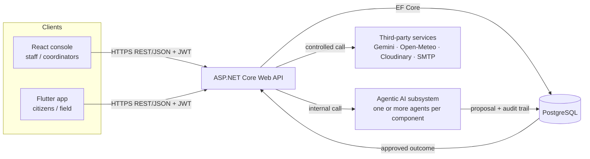
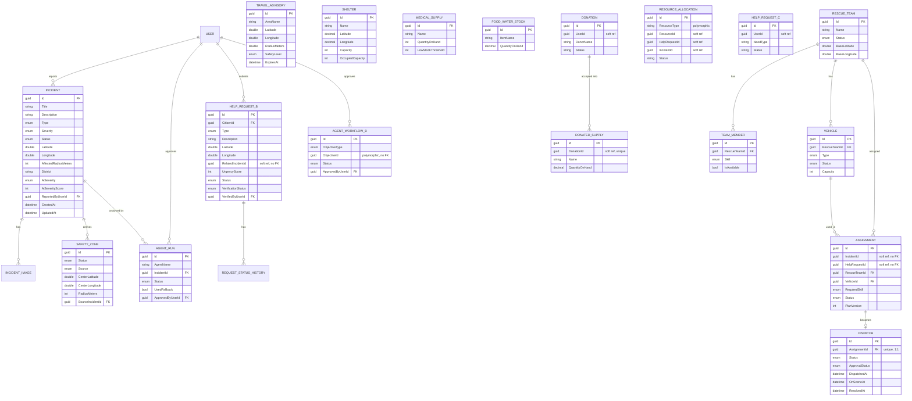

# Rescue Sri Lanka — Consolidated Report Outline (Group Report section)

> **How to use this file:** a copy-and-fill skeleton for the Group Report portion of the single consolidated
> PDF (spec Section 15). Content marked **[verified]** is pulled directly from the codebase and can be used
> as-is or lightly adapted. Content marked **[TODO — owner]** needs that component's owner to fill in — I
> only have full visibility into Component A; B/C/D need their own pass. Suggested page counts are the
> spec's own guidance (not a hard limit — quality over page count). This file doesn't touch any code.
>
> Companion file: [component-a-report.md](component-a-report.md) has Component A's Individual Report
> material and can be lifted into sections 3–5 and 9 below.

---

## 1. Overview, roles, architecture

### 1.1 Project overview

Sri Lanka is exposed to recurring, geographically distinct hazards: monsoon flooding across the low-lying
west and south, landslides in the central highlands during heavy rain, cyclonic storms along the coast, and —
as the 2004 Indian Ocean tsunami demonstrated at national scale — the risk of sudden, wide-area disasters
with little warning. When an incident happens, an effective response depends on three things happening in a
tight loop: someone has to *hear about it* quickly, someone has to *judge how serious it is* accurately, and
someone has to *act* — dispatch a rescue team, open a shelter, warn a district — before the situation
worsens. In practice, this loop is often run manually: phone calls to a coordination desk, severity judged by
whoever picks up, resources tracked on spreadsheets or in someone's head. That approach does not scale past a
handful of simultaneous incidents, has no audit trail, and puts the entire severity judgement on one
person's unaided assessment in the moment.

**Rescue Sri Lanka** puts that reporting-classification-response loop into a single, integrated system.
Citizens report a disaster from a Flutter mobile app — with a photo and GPS coordinates, not just a text
description — the moment they see it. An ASP.NET Core Web API, backed by PostgreSQL, is the single source of
truth for every client and every business rule. A purpose-built Agentic AI agent gives every report an
immediate, evidence-based first-pass severity and safety-zone classification, so a coordinator opens their
console to a queue already triaged rather than a queue of raw, unranked reports. Crucially, the agent never
has the final word: an Emergency Coordinator reviews its reasoning and the evidence it used, and only their
approval — or revision, or rejection — changes what the rest of the system treats as true. The same
architecture extends to three further response domains, each owned end-to-end by one student: travel
advisories and citizen help-request triage (Component B), shelter and supply management (Component C), and
rescue team dispatch (Component D).

### 1.2 User roles

The platform recognises five roles, enforced with JWT authentication and role-based authorization on every
protected endpoint (`[Authorize(Roles = "...")]`), not just hidden in the UI:

- **Citizen** — the public-facing role. Reports incidents with a photo and GPS location from the Flutter
  app, browses nearby hazards and safety zones without needing an account, and submits help requests once
  signed in. Citizens self-register; there is no seeded Citizen account, deliberately, because the whole
  point of the role is that anyone can become one.
- **EmergencyCoordinator** — owns the incident lifecycle. Verifies or rejects citizen reports, reviews and
  approves, revises or rejects the Incident Analysis Agent's severity proposal, can override severity by
  hand with a recorded reason, triggers district-wide warning emails, and manages the derived safety zones
  that appear on both the React map and the Flutter map.
- **ResourceManager** — owns Component C: shelters, medical supplies, food and water stock, incoming
  donations, and how they're allocated against demand.
- **RescueTeam** — the field role for Component D: receives dispatch assignments and reports status and
  progress back from the field.
- **HelpRequestManager** — owns Component B's triage side: verifies citizen help requests and runs the
  travel-advisory workflow that keeps tourists and residents informed about zones to avoid.

| Role | Primary client | Owning component |
|---|---|---|
| Citizen | Flutter (report, browse, help requests) | Cross-cutting |
| EmergencyCoordinator | React (review, approve, warn) | A |
| HelpRequestManager | React (triage, advisories) | B |
| ResourceManager | React (shelters, supplies) | C |
| RescueTeam | Flutter (field assignments) | D |

*[TODO — B/C/D owners]* Confirm whether your role also has any React or Flutter screens beyond the primary
client listed above (e.g. does a RescueTeam member ever use the React console?) and note it here.

### 1.3 Domain-complexity checklist (spec §4.1)

| Requirement | Status |
|---|---|
| ≥3 user roles with distinct permissions | ✅ 5 roles, enforced with JWT + role-based `[Authorize]` at the endpoint level |
| ≥4 major business components, one per student | ✅ Incidents & Map (A), Travel Advisories & Help Requests (B), Shelters & Supplies (C), Rescue Coordination & Dispatch (D) |
| CRUD + status workflows + search/filter/sort/pagination + reporting | ✅ for Component A (incident list has full server-side filtering, sorting and pagination; dashboard statistics endpoint). *[TODO — B/C/D]* confirm the same for your own list views |
| Meaningfully different purposes for React and Flutter | ✅ React is the staff/administrative console (dashboards, approval, monitoring); Flutter is the citizen/field app (reporting, live status, on-the-ground workflows) |
| ≥1 third-party service integration | ✅ Google Gemini (LLM), Open-Meteo (weather), Cloudinary (image storage), SMTP/testmail.app (email) — all currently in Component A. *[TODO]* add any integrations B/C/D own separately |
| ≥1 complete cross-platform workflow through every layer | ✅ see §1.5 |

### 1.4 System architecture



The architecture rests on one non-negotiable rule, stated explicitly in the assignment specification and
enforced throughout the codebase rather than left as a convention: **both client applications talk only to
the ASP.NET Core API.** Neither React nor Flutter ever queries PostgreSQL directly, and neither ever calls an
Agentic AI agent directly — every agent runs as an internal service invoked by the API, never exposed as its
own endpoint. This keeps a single point of enforcement for authentication, authorization, validation and
business rules, regardless of which client a request comes from.

The backend itself is organised by business component rather than by technical layer: each of
`Features/ComponentA` through `ComponentD` is a self-contained vertical slice with its own
controllers, DTOs, models, services and (where applicable) agents, sharing only what genuinely is
shared — the `User`/`UserRole` identity model, JWT issuance, and the `agent_runs` audit table every
component's agents write to. This mirrors the assignment's one-component-per-student ownership model
directly in the code, so contribution boundaries are unambiguous both in git history and in the folder
structure itself.

The Agentic AI subsystem is not a separate service — it runs inside the same ASP.NET Core process, called
internally by the relevant controller (e.g. `IncidentsController.Analyse` invokes
`IIncidentAnalysisAgent.AnalyseAsync` directly). This satisfies the specification's rule that any Python or
external agent service, had one been used, must sit behind the API rather than being called directly by a
client — here it's simpler still, since there is no separate service to secure in the first place.

### 1.5 The required end-to-end cross-platform workflow

The specification requires at least one demonstrated workflow that begins in one client, passes through
every layer of the stack, requires review or approval in the other client, and returns an updated status to
the initiating user. Component A's incident-reporting flow is that workflow, and it runs through all six
stages of the required pattern:

1. **Flutter** — a citizen opens the report screen, takes a photo, and the app reads their GPS position;
   they submit a title, description, hazard type and description of who's affected.
2. **ASP.NET Core** — `POST /api/incidents/with-photo` authenticates the request, validates every field,
   persists the report, stores the photo, and queues the Incident Analysis Agent to run in the background.
3. **PostgreSQL** — the incident, its image, and (once the agent has run) the agent's proposal are all
   persisted with full audit fields (`CreatedAt`, `ReportedAt`, and, on later decisions, who acted and when).
4. **Agentic AI** — the Incident Analysis Agent gathers evidence (nearby active incidents, 48-hour rainfall,
   the photo itself), reasons with a schema-constrained Gemini call or a deterministic rule-engine fallback,
   and writes a validated severity/zone proposal — never the severity in force — back to the database.
5. **React** — an Emergency Coordinator opens the incident queue, sees the AI's proposal and the evidence
   behind it in the Agent Panel, and approves, revises, or rejects it. Only this action changes the
   incident's severity in force and, where warranted, opens a safety zone and queues a district warning.
6. **Shared status back to the initiating client** — the approved severity and any new safety zone are
   immediately visible on the Flutter map the citizen who filed the report is using, closing the loop.

**Correction to an earlier draft of this document:** it previously claimed Component D's Safety Validation
Agent, or Component B's travel advisory, calls Component A's `GET /api/safetyzones/check` endpoint — that
claim came from a comment in Component A's own source code ("consumed by... Student B's travel advisory")
and was never actually checked against the code. A repo-wide search found no such call anywhere: the only
callers of that endpoint are Component A's own React dashboard and Flutter client. Component B built an
independent `POST /api/TravelAdvisories/check-safety` against its own `TravelAdvisory` entities instead, and
Component D's safety validation never leaves its own `ComponentDDbContext` plus Gemini. **There is currently
no verified cross-component API call in this codebase** beyond components reading each other's data directly
through the shared database (e.g. Component D's `IncidentReadService` reads Component A's `Incident` rows
in-process). Two honest options before submission: wire up the integration the code comment already implies
(cheap — Component B's `check-safety` could call Component A's `/api/safetyzones/check` instead of
duplicating the logic against a separate, unrelated `TravelAdvisory` table), or drop the claim from the
report and rely solely on §1.5's single-component workflow as your cross-platform evidence, which already
independently satisfies the spec's requirement on its own.

### 1.6 Component ownership

Each student takes primary, end-to-end ownership of one business component — backend, database, React
screens, Flutter screens, tests and a distinct Agentic AI contribution — per the assignment's
one-component-per-student rule.

| Component | Owner | Scope |
|---|---|---|
| A — Incidents & Disaster Map | Lelum Jayasooriya (IT24101153) | Citizen reporting, live incident map, derived safety zones, district warnings, and the Incident Analysis Agent |
| B — Travel Advisories & Help Requests | IT24102382 | Zone-linked travel advisories, citizen help-request triage, and the Planner/Coordinator Agent |
| C — Shelters, Supplies & Donations | IT24103081 | Shelter capacity, medical/food/water stock, donation intake and resource allocation |
| D — Rescue Coordination & Dispatch | Chamath Dissanayake (it24102141) | Rescue teams, vehicles, dispatch and field assignments, via an Agent Orchestrator coordinating three further agents |

*[TODO — group]* Add each student's full name and student ID as it should appear on the cover page and in
the Individual Report headers — the identities above are inferred from git author information and should be
confirmed by each person.

---

## 2. ER diagram, API / React / Flutter design

### 2.1 Database architecture note

The system does not use a single `DbContext`. Components A, B and C share `AppDbContext`; **Component D uses
its own separate `ComponentDDbContext`**, with its own independent EF Core migration history for its five
core tables (`RescueTeams`, `TeamMembers`, `Vehicles`, `Assignments`, `Dispatches`). Both contexts target the
same physical PostgreSQL database — this was a deliberate choice to let Component D evolve its schema without
migration conflicts against the other three students' models, at the cost of the `AgentWorkflow`/`AgentStep`
tables needing to be excluded from Component D's own migrations (`.ExcludeFromMigrations()`) since a
differently-shaped version of the same two tables is owned centrally. Worth one paragraph in the technical
report as a deliberate trade-off, not an oversight.

**Two entities are named `HelpRequest`** and are genuinely different things, not a naming collision to fix:
Component B's `HelpRequest` is a citizen's request for help (water/food/medical/rescue/shelter), stored in
table `HelpRequests`. Component C's `HelpRequest` is a resource request against shelter/supply stock, mapped
under the C# alias `ResourceHelpRequest` to its own table `resource_help_requests`. Say this explicitly in
the report — it's the kind of thing a viva question could probe ("why do you have two HelpRequest tables?").

### 2.2 ER diagram



Note the recurring pattern across B, C and D: cross-component references (`RelatedIncidentId`,
`IncidentId`/`HelpRequestId` on `Assignment`, `IncidentId`/`HelpRequestId` on `ResourceAllocation`) are
**plain Guid columns, not enforced foreign keys** — a deliberate decoupling so each component's schema can
evolve and migrate independently, at the cost of the database not being able to catch a dangling reference
itself. Worth a sentence in the technical report as a named trade-off (referential integrity vs. component
independence), since an evaluator familiar with relational design will notice it either way.

### 2.3 API design summary

**Component A — 19 endpoints** (full table in
[component-a-report.md §2](component-a-report.md#2-architecture--data-model)): incidents, agent runs, safety
zones, notifications.

**Component B — 16 endpoints across 3 controllers:**

| Controller | Routes | Business-specific operations (beyond CRUD) |
|---|---|---|
| `HelpRequestsController` (`api/HelpRequests`) | 11 | AI draft-analysis pre-submission, AI credibility/priority analysis via the Planner Agent, status-transition state machine with history, verify/reject-fake workflow |
| `TravelAdvisoriesController` (`api/TravelAdvisories`) | 6 | `check-safety` — checks a set of points against active advisories (self-contained, not yet linked to Component A's zones — see §1.5) |
| `AgentWorkflowsController` (`api/agentworkflows`) | 3 | Trigger the Planner Agent workflow; human approve/reject decision gate |

**Component C — 21 routes, all in one `ResourcesController` (`api/resources`):**

CRUD for shelters/medical-supplies/food-water-stock/managed-supplies, plus business logic: low-stock
alerting (`alerts/low-stock`), manual and auto-match resource allocation (`allocations`,
`allocations/match`), allocation release with stock restore (`allocations/{id}/release`), donation intake
with donation→stock conversion on acceptance, and batch submission endpoints for both help-requests and
donations (multi-item in one request). All backed by a single 1,144-line `ResourceManagementService`.

**Component D — 4 controllers:**

| Controller | Routes | Business-specific operations |
|---|---|---|
| `AgentWorkflowController` (`api/agents/workflows`) | 2 | Starts the full Agent Orchestrator run |
| `AssignmentsController` (`api/assignments`) | 7 | Ranked team matching, plan revision (versioned), AI safety validation (recommendation only), human approve/revise/reject decision that triggers dispatch creation |
| `DispatchesController` (`api/dispatches`) | 5 (2 disabled) | Lifecycle state transitions (Pending→Dispatched→EnRoute→OnScene→Resolved/Cancelled); two legacy routes intentionally return 409 in favour of the newer `/assignments/{id}/decision` path — worth explaining in the viva as a deliberate API evolution, not dead code left by accident |
| `RescueTeamsController` (`api/rescueteams`) | ~9 | CRUD for teams/members/vehicles; deletes correctly return 409 (not 500) when blocked by an active assignment |

### 2.4 React design

| Component | Top-level component(s) | Views / tabs | State management |
|---|---|---|---|
| A | `DisasterDashboard` | Overview, Map, Zones, Incident queue (now sortable + paginated), Agent activity; detail drawer with photo gallery, `ReviewPanel`, `AgentPanel` | Plain `useState`/`useEffect` |
| B | `HelpRequestDashboard`, `HelpRequestsReview`, `TravelAdvisoryManager` | Metrics + Leaflet map + priority queue (dashboard); search/filter/sort/paginate + AI-review modal + status state-machine controls (review); advisory CRUD | Plain hooks, `authFetch` helper |
| C | `ResourceDashboard` (single file, sidebar nav, not router-based) | Overview, Supplies (category-grouped inventory), Requests (accept/reject/allocate), Donate (accept/reject by submission group) | Plain hooks |
| D | `RescueCoordinatorDashboard` (+ a more compact embeddable `RescueCoordinationSection` variant), `ResourceManagementPanel` | Overview, Rescue teams, Assignments, AI safety review, Active dispatches | Plain hooks, manual `Promise.allSettled` refresh |

Every component independently chose plain React hooks over Redux/Context/a state library — worth naming as a
**consistent, group-wide architectural decision** in the ADR for React state management (§8), rather than
four separate uncoordinated choices that happened to agree.

### 2.5 Flutter design

| Component | Screens | Device features |
|---|---|---|
| A | `report_screen` (camera + GPS, form + submit), `disaster_map_screen` (live map, severity filter), `incident_sheet` (detail + AI rationale) | Camera/image picker, GPS |
| B | `home_screen` (hub), `submit_request_screen` (AI draft analysis, photo, GPS), `my_requests_screen` (+ detail), `my_requests_map_screen`, `safety_check_screen` | Camera/image picker (via Cloudinary upload), GPS |
| C | `resource_home_screen` (request/donate toggle, multi-item forms) | None — pure form submission |
| D | `rescue_coordinator_dashboard`, `rescue_teams_screen`, `assignments_screen`, `ai_safety_review_screen`, `active_dispatches_screen`, shared `coordination_forms` widgets | None — team base location is manual lat/lng text entry, not live GPS |

The spec asks for "at least one meaningful device feature" — satisfied comfortably by A and B (camera +
GPS in both). C and D's mobile screens are deliberately form/list-oriented (matching their
coordination/logistics purpose), which is a defensible design choice, but if a viva question specifically
targets "show me a device feature in your component," students on C or D should be ready to explain that
choice rather than be caught looking for one that isn't there.

---

## 3. Technical report (suggested 10–15p)

Suggested breakdown — adjust weighting toward whichever components need the most explaining:

1. **System-wide architecture & integration rules** (1–2p) — how React/Flutter/API/DB/AI fit together, the
   "clients talk only to the API" rule, shared identity/JWT model. Reuse section 1.4 above.
2. **Backend architecture** (2–3p) — layering (controllers/DTOs/services), DI, EF Core + PostgreSQL, the
   `Features/ComponentX` folder structure and why (isolate each student's ownership while sharing `User`,
   auth, and the `agent_runs` table).
3. **Per-component technical deep dive** (1–2p each × 4) — business rules, key workflows, one interesting
   design decision per component. Component A's is drafted in
   [component-a-report.md](component-a-report.md).
4. **Data model & migrations strategy** (1p) — EF Core Migrations approach, seed data strategy
   (`DbSeeder`, `IncidentSeeder`, per-component seeders), audit fields.
5. **Agentic AI architecture at the system level** (1–2p) — how the 4 components' agents relate (or don't);
   Component B's Planner Agent is explicitly designed to eventually delegate to A/C/D — describe the current
   real state (some steps use placeholder data, per that file's own comments) versus the original design
   intent honestly.
6. **Third-party integrations** (1p) — table of all integrations across all 4 components, business purpose,
   how credentials are protected.

---

## 4. Testing report (suggested 6–10p)

| Layer | Evidence **[verified where marked]** |
|---|---|
| Backend | **[verified]** 236 tests passing (`dotnet test`) — unit, service-layer, auth/authz, controller/API integration, agent evaluation. List key files: `IncidentAnalysisAgentTests` (20), `AgentRunServiceTests` (6), `AuthorizationIntegrationTests`, `GlobalExceptionHandlerTests` (3), plus B/C/D's own suites (`ComponentBServiceTests`, `DispatchServiceTests`, `ResourceManagementServiceTests`, etc.) |
| Database | *[TODO]* Constraint/migration/transaction tests — cite specific test names |
| React | **[verified — gap]** Only one test file exists repo-wide (`TravelAdvisoryManager.test.tsx`, Component B). Component A has zero React tests. *State this honestly rather than imply coverage that isn't there* — and if time allows, add a couple before submission. |
| Flutter | **[verified]** `auth_test.dart` (covers Component A's API client), `component_b_test.dart`, `resource_app_test.dart`, `resource_api_test.dart`, `help_tab_test.dart`, `widget_test.dart`, `app_ui_test.dart`. No widget tests target Component A's `report_screen`/`disaster_map_screen` specifically. |
| End-to-end | *[TODO]* Document the one full Flutter→API→DB→Agent→React→status workflow you demonstrate (§1.5 above) — screenshots or a short script of the manual walkthrough |
| Performance | See Section 6 |
| Agent evaluation | See Section 5 |
| CI | **[verified]** `.github/workflows/ci.yml` — backend build+test, frontend build+lint, Flutter analyze+test, on every push/PR to `main`. Screenshot a green run for the report. |

---

## 5. Agentic AI evaluation report (suggested 5–8p)

One subsection per agent. Component A's is fully drafted — use it as the template shape for the others.

### 5.1 Incident Analysis Agent (Component A) **[verified — see component-a-agent.md]**

Contract, allow-listed tools, planning (single-step classification, not multi-agent delegation itself — it
*is* one of the delegated specialists), deterministic validation, human approval gate, security controls: all
documented in [component-a-agent.md](component-a-agent.md). **Still needed:** the live-run evaluation table
in that doc's §10.2 is a template — run it against real Gemini calls and fill in actual severity
match-rate, median/max latency, fallback rate before this section can be finished.

### 5.2 Planner / Coordinator Agent (Component B) **[TODO — owner]**

Use [component-b-planner-agent.md](component-b-planner-agent.md) as source material. Cover: how it builds
the multi-step plan, which steps are real vs. still placeholder logic against reference data (the code's own
comments flag this — report it honestly, a partially-implemented delegation is still gradeable if you're
upfront about it), and its own approval gate.

### 5.3 Safety Validation Agent (Component D)

Component D's owned Safety Validation Agent evaluates an existing assignment and recommends
APPROVE, REVISE, or REJECT. GeminiSafetyValidationAgent uses seven allow-listed read-only tools
and ten mandatory deterministic checks. It does not call Component A's zone-check endpoint.
Workflow/audit persistence is separate from operational state changes.

AI recommends -> human coordinator decides -> backend live-revalidates -> transactional dispatch.
The separate SafetyValidationAgent supplies the approval-time deterministic guard.
Formal offline evidence, contracts, security boundaries, 15 golden cases and known limitations:
[Component D Safety Validation Agent - Golden Evaluation](component-d-safety-agent-golden-evaluation.md).
The orchestrator and other agent integrations are separate from this owned-agent evaluation.

### 5.4 Component C **[flag — do not skip]**

No agent code currently exists under `Features/ComponentC`. This needs one of: (a) build a minimal but real
agent before submission, (b) get written lecturer approval for a scope adjustment per spec §3, or (c) report
the gap honestly and accept the rubric consequence. Silently omitting this section would look worse at the
viva than addressing it directly.

### 5.5 Group-level summary against spec §12's "Agent Evaluation" row

Checklist: golden case per agent, correct planning/delegation, tool selection, structured outputs,
deterministic validation, business-rule compliance, approval enforcement, prompt-injection resistance,
failure recovery, safe failure. Component A has automated test coverage for every item on this list already
([component-a-agent.md §10.1](component-a-agent.md#101-automated-tests)) — the fastest way to fill this
section for B/C/D is the same pattern: a table mapping each spec requirement to a specific test name.

---

## 6. Performance report (suggested 3–5p)

- **Concurrent request test** — pick 2–3 endpoints (e.g. `GET /api/incidents`, `POST /api/incidents/{id}/analyse`)
  and run a simple load test (`k6`, `hey`, or even a small script firing N parallel requests). Report
  success/failure rate and p50/p95 response time.
- **Database response time** — a few representative queries' timings (the incident list with filters, the
  nearby geo-query).
- **Agentic AI latency** — query the `agent_runs` table directly:

```sql
SELECT agent_name, AVG(duration_ms), MAX(duration_ms), COUNT(*) FILTER (WHERE used_fallback)
FROM agent_runs GROUP BY agent_name;
```

  Report median/max latency per agent and the fallback rate — this doubles as agent-evaluation evidence too.
- *[TODO — group]* Agree on one shared load-testing approach so results are comparable across components
  rather than four different methodologies.

---

## 7. Deployment report (suggested 3–5p)

| Component | Where | Status **[verified]** |
|---|---|---|
| ASP.NET Core API | Azure App Service (`rescuesl-api`) | ⚠️ **Did not resolve** when checked (`rescuesl-api.azurewebsites.net`) — confirm the App Service is running and redeploy if needed before this section can honestly claim a working health/Swagger URL |
| PostgreSQL | *[TODO — fill in host]* | |
| React | Vercel (`frontend/vercel.json`) | *[TODO — fill in live URL]* |
| Flutter | APK | *[TODO — build and attach]* |
| Agentic AI | Runs inside the API process | Needs `GoogleAi__ApiKey` set in App Service config; falls back to rule engines if absent |

Required content: environment-variable list (see the real key names already documented in
[component-a-report.md](component-a-report.md) for Component A's config — `Jwt__*`, `GoogleAi__*`,
`Cloudinary__*`, `Email__*`, `ConnectionStrings__DefaultConnection`), migration strategy
(`Database:MigrateOnStartup`), and — per spec's own instruction — **open every submitted link in a private/
incognito window before submitting** and note that you did.

---

## 8. Architecture Decision Records

**Existing — [verified], all in `docs/adr/`:**

| # | Decision | Owner |
|---|---|---|
| 0001 | LLM provider (Gemini over the original Ollama plan) | Student A |
| 0002 | Incident photo storage (Cloudinary vs. local disk) | Student A |
| 0003 | Map tile provider | Student A |
| 0004 | Email delivery + test inbox | Student A |

**Still needed per spec §14.2** (asks explicitly for these) — *[TODO — group, 1 page each]*:

- React state-management approach (Context API / Redux Toolkit / Zustand / other — whichever you actually
  used, with the alternatives you considered)
- Flutter state-management approach
- Database schema strategy for agent workflow state *(the `agent_runs` shared-table approach is already
  described in [component-a-agent.md §8](component-a-agent.md#8-persisted-state--agent_runs) — turning that
  description into a proper ADR with alternatives considered is most of the work already done)*
- Cloud deployment platform choice (Azure for the API, Vercel for React — why these, what else was
  considered)

3–6 ADRs total is the spec's suggested range; you're at 4 now, all from one component — 2 more from the
list above rounds this out and demonstrates the other students' architectural reasoning too.

---

## 9. Security considerations (suggested 1–2p)

- **AuthN/AuthZ:** JWT bearer tokens, role-based `[Authorize]` per endpoint, 5 roles.
- **Secrets:** all provider keys (Gemini, Cloudinary, SMTP) via configuration/environment variables;
  `appsettings.Development.json` git-ignored; never commit real secrets.
- **Global error handling [verified]:** `GlobalExceptionHandler` catches unhandled exceptions, logs them
  server-side, returns a generic `ProblemDetails` body with no internal detail leaked outside Development.
- **Agent-specific controls [verified for A, TODO for B/C/D]:** allow-listed tools only, schema-constrained
  LLM output with deterministic re-validation, prompt-injection resistance (fixed system instruction, citizen
  text only as labelled data), timeouts + retry limits, safe-failure fallback to a rule engine.
- **Data minimisation:** the reporter's identity/email is never passed to the LLM; only incident fields and
  photos reach the model.
- *[TODO — group]* OWASP-style pass: SQL injection (mitigated by EF Core parameterisation — confirm no raw
  SQL anywhere), XSS (React's default escaping — confirm no `dangerouslySetInnerHTML` anywhere), CORS
  configuration (currently wide-open on localhost for dev, explicit allow-list for production — confirm the
  production list is actually set before deployment).

---

## 10. AI usage declaration (group-level, consolidated)

> All AI tool use on this project was disclosed per Section 18 of the assignment specification, at the
> permitted Level 4 (Full AI) for development tasks. AI assistance was used for
> *[list honestly per component: code generation/refactoring, documentation drafting, gap-analysis against
> the spec, etc.]*. Every group member has reviewed, tested and can independently explain, modify and debug
> the code submitted under their name. No AI tool was used during the final demonstration or viva; the
> submitted application's Agentic AI subsystem is run live.

This must match each student's individual AI usage log (in their own Individual Report section) — a mismatch
is explicitly called out in the spec as disqualifying ("does not match the student's Git history and AI usage
log will not receive credit"). Have each student review this paragraph against their own log before
finalizing.

---

## Before you submit — quick cross-check against Section 20's checklist

- [ ] Every component has ≥4 endpoints and a distinct agent — **Component C currently does not** (§5.4 above)
- [ ] ≥4 distinct agents group-wide — yes (A:1, B:1, D:3), even without C
- [ ] Deployed API/Swagger/health URLs actually resolve — **currently failing, fix first**
- [ ] 3–6 ADRs — have 4, add 2 more from §8's list for full coverage of the spec's required topics
- [ ] Every submitted link opened in a private/incognito window
